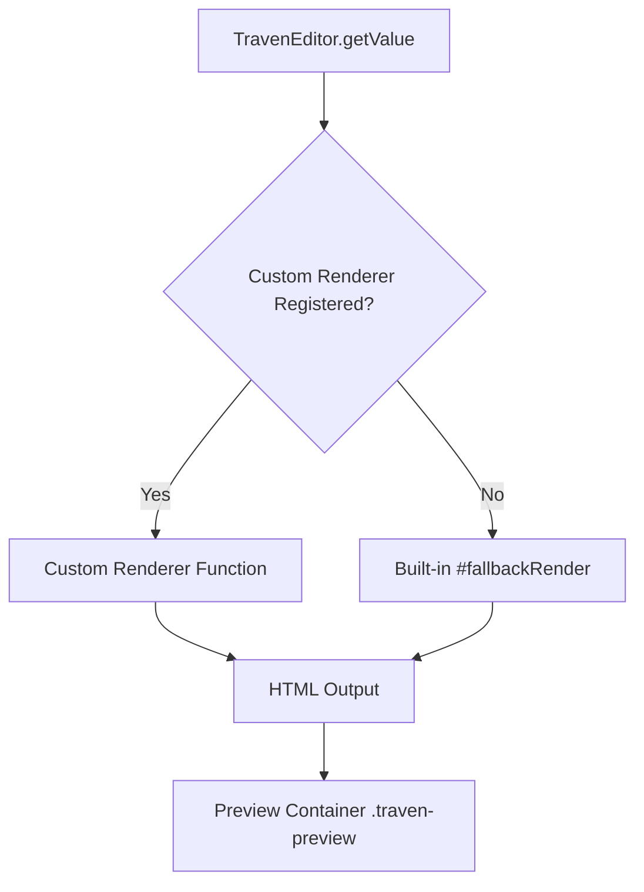

# Custom Markdown Rendering

By default, Traven uses an out-of-the-box fallback renderer (`#fallbackRender`) that supports basic Markdown syntax, LaTeX math, and custom shortcodes (like `[image]`, `[video]`, `[audio]`, `[figure]`, and `[component]`) securely with zero dependencies.

However, for production applications, you can register a custom Markdown-to-HTML rendering engine (such as **Marked**, **markdown-it**, or **micromark**) to achieve full GitHub Flavored Markdown (GFM) compliance, optimize performance, or add custom parsing rules.

---

## The Renderer Pipeline

Traven decouples the WYSIWYM editor interface from the HTML preview panel. The preview pane relies on the public API method `getContentHtml()` to fetch compiled HTML.



When a custom renderer is registered using `registerRenderer(renderFn)`, the editor delegates all HTML compilation to that function whenever `getContentHtml()` is invoked.

---

## How to Register a Custom Renderer

To configure a custom renderer, initialize the editor and call `registerRenderer` passing a function that accepts the raw Markdown string and returns a compiled HTML string.

### 1. Using Marked (Recommended)

[Marked](https://marked.js.org/) is a fast, lightweight Markdown compiler.

```javascript
import { TravenEditor } from "traven-editor";
import { marked } from "marked";

// Initialize Traven
const editor = new TravenEditor({
  element: document.getElementById("editor-container"),
  initialValue: "# Hello from Traven!"
});

// Register Marked as the Markdown engine
editor.registerRenderer((markdown) => {
  return marked.parse(markdown, {
    gfm: true,
    breaks: true
  });
});
```

### 2. Using markdown-it

[markdown-it](https://github.com/markdown-it/markdown-it) is a highly configurable, pluggable Markdown parser.

```javascript
import { TravenEditor } from "traven-editor";
import markdownIt from "markdown-it";

const md = markdownIt({
  html: false, // Security: Disable raw HTML tags
  linkify: true,
  typographer: true
});

const editor = new TravenEditor({
  element: document.getElementById("editor-container"),
  initialValue: "# Hello from Traven!"
});

// Register markdown-it as the Markdown engine
editor.registerRenderer((markdown) => {
  return md.render(markdown);
});
```

---

## Styling the Output

To maintain consistent styling between the editor's WYSIWYM mode and the HTML preview pane, Traven applies the active CSS skin directly to the preview container.

> [!NOTE]
> The preview container is assigned the CSS class `.traven-preview`.
> All theme styles (like `skin-light.css`, `skin-beginner.css`, and the dark-mode theme) target elements within `.traven-preview`. As long as your custom renderer produces standard semantic HTML elements (e.g., `<h1>`, `<p>`, `<blockquote>`), it will inherit the layout, typography, colors, and borders of the active skin automatically.

---

## Handling Custom Shortcodes (Optional)

Traven supports several custom block and inline shortcodes (e.g., `[image ...]`, `[component ...]`). If you use a custom renderer, you may need to extend it to handle these shortcodes to avoid rendering them as plain text.

Below is an integration example using a regex-based pre-processor before passing the content to Marked:

```javascript
editor.registerRenderer((markdown) => {
  // Pre-process Traven's custom [figure] shortcode
  let processed = markdown.replace(
    /\[figure\s+align="([^"]+)"\s+size="([^"]+)"\s+caption="([^"]+)"\]([\s\S]*?)\[\/figure\]/g,
    (match, align, size, caption, content) => {
      return `<figure class="traven-figure align-${align} size-${size}">
        ${content}
        <figcaption class="traven-figure-caption">${caption}</figcaption>
      </figure>`;
    }
  );

  // Compile the rest with Marked
  return marked.parse(processed);
});
```

Alternatively, you can write a custom plugin for your parser (such as `markdown-it` plugins) to hook directly into the AST parsing lifecycle.
