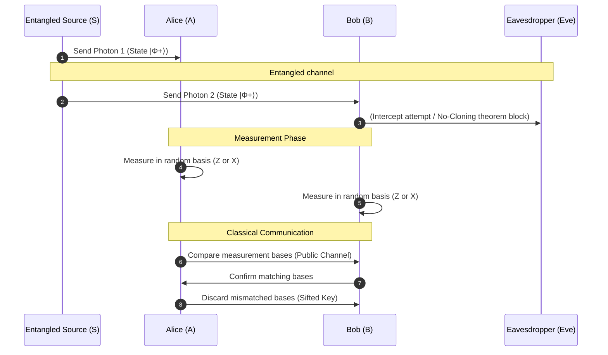

# A Study on Quantum Entanglement & Key Distribution Protocols

*Published in the Journal of Quantum Informatics · June 8, 2026*

### Abstract
This research paper explores the practical implementation of quantum key distribution (QKD) protocols, focusing on the E91 entanglement-based scheme. We analyze key generation rates under simulated eavesdropping (Eve) scenarios and present experimental data comparing key security metrics.

[component name="pullquote"]
"Quantum cryptography is the first application of quantum mechanics that is based on the laws of physics rather than on the limitations of mathematical computations."
[/component]


## 1. Introduction and Quantum State Formulation

Quantum entanglement represents a physical phenomenon where pairs or groups of particles are generated, interact, or share spatial proximity in ways such that the quantum state of each particle cannot be described independently of the state of the others. 

In this paper, we formulate the polarization state of an entangled photon pair (EPR pair) using Dirac bra-ket notation:

$$\left|\Phi^+\right\rangle = \frac{1}{\sqrt{2}} \left( \left|00\right\rangle + \left|11\right\rangle \right)$$

For any individual qubit, the state vector is defined as a linear combination of the orthonormal basis states $|0\rangle$ and $|1\rangle$:

$$\left|\psi\right\rangle = \alpha\left|0\right\rangle + \beta\left|1\right\rangle$$

where the complex coefficients satisfy the normalization constraint:

$$\left|\alpha\right|^2 + \left|\beta\right|^2 = 1$$

## 2. Protocol Sequence and Key Exchange Flow

The entanglement-based E91 protocol relies on the distribution of entangled photon pairs. The following sequence diagram illustrates the polarization correlation measurement exchange between Alice, Bob, and the Source ($S$):



## 3. Protocol Performance Matrix

We evaluated three prominent QKD schemes across varying fiber optic distances. The table below outlines the sifted key rate, quantum bit error rate (QBER), and maximum security thresholds.

| Protocol Scheme | Entanglement Based | Max Fiber Distance (km) | Typical QBER (%) | Security Proof basis |
| :--- | :---: | :---: | :---: | :--- |
| **BB84 (Decoy-State)** | No | 150 | $1.2\% - 2.5\%$ | Shannon Entropy Bounds |
| **E91 (Entangled)** | Yes | 100 | $1.8\% - 3.2\%$ | Bell's Inequality ($S \le 2\sqrt{2}$) |
| **COW (Coherent)** | No | 200 | $2.0\% - 4.1\%$ | Intercept-Resend Limits |

## 4. Qubit Simulation Code

The following Python script simulates the generation of a Bell state $\left|\Phi^+\right\rangle$ and calculates the correlation measurement probability vectors:

```python
import numpy as np

def generate_bell_state_probabilities(noise_factor=0.05):
    """
    Simulates measurement correlation probabilities for the |Φ+⟩ Bell State
    accounting for experimental channel noise.
    """
    # Ideal Bell state probabilities: P(00) = 0.5, P(11) = 0.5
    ideal_probs = np.array([0.5, 0.0, 0.0, 0.5])
    
    # Introduce uniform white noise
    noise = np.ones(4) * (noise_factor / 4.0)
    simulated_probs = ideal_probs * (1.0 - noise_factor) + noise
    
    # Normalize probabilities
    simulated_probs /= np.sum(simulated_probs)
    
    return {
        "P(00)": simulated_probs[0],
        "P(01)": simulated_probs[1],
        "P(10)": simulated_probs[2],
        "P(11)": simulated_probs[3]
    }

print("Simulated Quantum Correlations:", generate_bell_state_probabilities())
```

## 5. Implementation Notes & Alerts

When deploying entanglement-based systems, hardware synchronization is critical to prevent time-bin mismatch errors.

[info title="Time-Tagging Synchronization" collapsible="true"]
Ensure that Alice and Bob's time-tagging units (TDCs) are synchronized via a common reference clock or GPS disciplined oscillator. Drift should be kept below $\Delta t < 10\text{ ps}$ to prevent false-negative correlations.
[/info]

[warning title="Critical Security Warning: Bell Violations" collapsible="false"]
If the measured Bell parameter $S$ falls below $2$, the channel is considered compromised, or the entanglement source has decohered. Immediately abort key generation and perform calibration.
[/warning]

## 6. Philosophical Context

[blockquote author="Richard Feynman" source="The Character of Physical Law"]
I think I can safely say that nobody understands quantum mechanics. If you can avoid it, do not keep saying to yourself, 'But how can it be like that?' because you will get 'down the drain', into a blind alley from which nobody has yet escaped.
[/blockquote]


