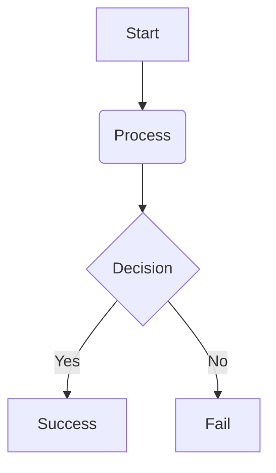

# Hello, I'm Traven!

TAKE ME FOR A SPIN.  Everything you see here is a **fully live editor.** Type anywhere, like *just right here, for instance.* Everything works using the Markdown you know and love, along with a few MDX components thrown in to make Markdown more powerful (but they are completely optional, so go ahead and ignore them if components are not your thing).

## What You See Is What You Get (*and what you mean*)

Writing in Traven is designed to be completely distraction-free. As you type, the underlying Markdown formatting characters are displayed inline to keep you close to the source, but they disappear the moment your cursor moves away. This approach, known as WYSIWYM (What You See Is What You Mean), combines the simplicity of plaintext Markdown with the rich formatting of a visual word processor. To find out more about Traven and how to integrate the editor in your own projects, go to **[traven.dev](https://traven.dev)**

Good writing demands clear typography. Traven fully supports all standard Markdown text formats, including:
*   **Bold text** (`**bold**` or `__bold__`) for strong emphasis
*   *Italicized text* (`*italic*` or `_italic_`) for emphasis
*   ~~Strikethrough~~ (`~~strikethrough~~`) for corrections
*   `Inline code` (``inline code``) for tech terms
*   [Hyperlinks](https://github.com) (`[link](url)`) for reference links

Also supports subscript, such as the water molecule: H~2~O 
and superscript, like Einstein's equation: E = mc^2^ 

Here is a sample of how a blog post might read in an editorial layout. Notice how the headers, paragraphs, and media flow naturally together:

## The Art of Distraction-Free Writing
Writers hate overload. Notification badges, cluttered editing interfaces, and complex design systems pull attention away from the main task of *putting words on the page*. In a WYSIWYM editing environment, writers maintain their flow state. There are no heavy preview panels or complex layout settings to configure. You simply write, structure your thoughts with headings, and let stylesheets handle the rest.

Want to draw attention to key phrases? Add ==highlight formatting== directly on inline text using standard double equals delimiters:

==This text block is highlighted. Pro-tip: Click on this text to discover the delimiters. You can edit them yourself.==

<Image src="https://traven.dev/img/sample.jpg" align="center" size="large" alt="Image with a caption. Edit me!" caption="Unlike plain Markdown, images can have captions and positioning" />

You can easily structure your thoughts using bulleted or nested lists:
1.  **First Item**: This is a numbered list item.
2.  **Second Item**: With some nested lists:
    *   Sub-bullet one
    *   Sub-bullet two
3.  **Third Item**: Back to the parent list.

- [x] Checkboxes are of course also possible, 
- [ ] as are unchecked boxes, for instance in a Task List.

### Code blocks (with optional syntax highlighting)
Code blocks are clean, readable, and support dynamic syntax highlighting. To keep the core editor bundle small, language syntax highlighting is opt-in and can be chosen when you embed the editor.

Here is an example of a code block:

```javascript
// A simple function to greet users and log messages
function greetUser(username) {
  const message = `Hello, ${username}! Welcome to Traven.`;
  console.log(message);
  return message;
}

greetUser("Author");
```

### Mermaid Diagrams (Flowcharts & Visualization)
You can render diagrams directly from raw text code blocks:



### Structured Tables
Markdown tables are rendered as rich, interactive database-style visual tables in the editor. You can double-click on any table block to open a spreadsheet-style table editor modal.

| Feature | Markdown | Traven WYSIWYM | Extensible |
| :--- | :---: | :---: | :---: |
| **LaTeX Math** | `$E=mc^2$` | Live Render | Yes |
| **MDX Components** | `<Video />` | Visual Cards | Yes |
| **Highlights** | `==text==` | Sleek Yellow | Yes |
| **Tables** | `\| col \|` | Interactive | Yes |

### Content Containers (Info & Warning Boxes)
To highlight notices, callouts, or warnings, Traven provides ready-made interactive component boxes. Here are two examples that come built-in with the editor, but you can style and add unlimited elements and components and style them any way you want. Content can be hardcoded, from your Markdown, or inserted dynamically using Twig.

Need a quick info callout? Use `<Callout type="info">` for tips, notes, or explanations. You can set the box title (optional) and choose if the box is collapsible.

<Callout type="info" title="Pro Tip: Editing Components" collapsible="true">
Double-click anywhere on this info box to bring up its interactive properties panel. From there, you can change the title or toggle whether the box is collapsible.
</Callout>

To get a differently styled Warning Box, use `<Callout type="warning">` to draw attention to critical actions, system notifications, or safety warnings.

<Callout type="warning" title="Important Alert">
To avoid parsing errors, use matching closing tags on all your open MDX components when editing raw Markdown. Or just handle everything using toolbar buttons and Traven's interactive modals. That makes everything simpler and error-proof.
</Callout>

### Blockquotes & Pullquotes

Quote blocks can be formatted as standard blockquotes or as stylized magazine-style pullquotes.

For things like author blockquotes, use `<Quote>` to present quotes with beautiful author attributions and source citations. Like anything else, you can style the quotes any way you want with an external stylesheet, and the styles show up directly inside the editor as WYSIWYG: What You See Is What You Get:

<Quote author="James Baldwin" source="The Fire Next Time">
Love takes off the masks that we fear we cannot live without and know we cannot live within.
</Quote>

For the more graphic, editorial pullquotes, use `<Pullquote>` to break up long blocks of text with large, high-impact pull-out quotes:

<Pullquote>
"Traven completely bridges the gap between pure Markdown and modern rich-text editors."
</Pullquote>

### GitHub-style Alert Callouts

Alternatively, you can write native Markdown blockquotes starting with an alert marker (such as `[!NOTE]`, `[!TIP]`, `[!IMPORTANT]`, `[!WARNING]`, or `[!CAUTION]`) to render clean, responsive notifications:

> [!NOTE]
> This is a standard note alert containing helpful context. It uses a clean blue border and background tint.
>
> You can even write multiple paragraphs inside the same alert.

> [!TIP]
> This is a tip alert with advice for writing more efficiently.

> [!WARNING]
> This is a warning alert, calling attention to actions that could lead to configuration issues.

## Embedded Media Assets

Traven makes embedding external or local media a breeze. Each media tag is rendered as an interactive placeholder card with inline edit controls.

### YouTube Video Embeds
Easily display video playbacks using `<Video />`:

<Video src="https://www.youtube.com/watch?v=dQw4w9WgXcQ" caption="Never Gonna Give You Up - Rick Astley" align="center" size="medium" />

### Audio Embeds
Integrate podcast episodes or audio files using `<Audio />`:

<Audio src="https://www.soundhelix.com/examples/mp3/SoundHelix-Song-1.mp3" size="large" caption="SoundHelix Song 1 (Sample Audio Stream)" />

### LaTeX Mathematical Formulas
Traven features native LaTeX math rendering via KaTeX. Delimiters hide when the cursor is elsewhere, leaving beautiful mathematical typography.

#### Inline Math
Show formulas inline with your text, like $E = mc^2$ or the quadratic formula: $x = \frac{-b \pm \sqrt{b^2 - 4ac}}{2a}$.

#### Display Math Blocks
For complex or standalone equations, use double dollar signs:
$$\int_{-\infty}^{\infty} e^{-x^2} dx = \sqrt{\pi}$$
$$\sum_{i=1}^{n} i^3 = \left(\frac{n(n+1)}{2}\right)^2$$

### And, for when Markdown isn't enough: Rendered HTML

<div style="text-align: center">
  A bit of centered text here
</div>

which can both be a block of HTML (like the line above) or <span style="border: 1px solid; padding: 0 0.5rem;">HTML directly here</span>, inline, as shown in this sentence.

# Ready to build?
Get Traven with a **one-line include**. It is free and you can customize it with themes and toolbars that fit any look and feel that you prefer. To find out more about Traven and how to integrate the editor in your own projects, go to *[traven.dev](https://traven.dev)* and read more about how easy Traven is to embed and what else you can do with the powerful configuration options that are hidden under the hood.


