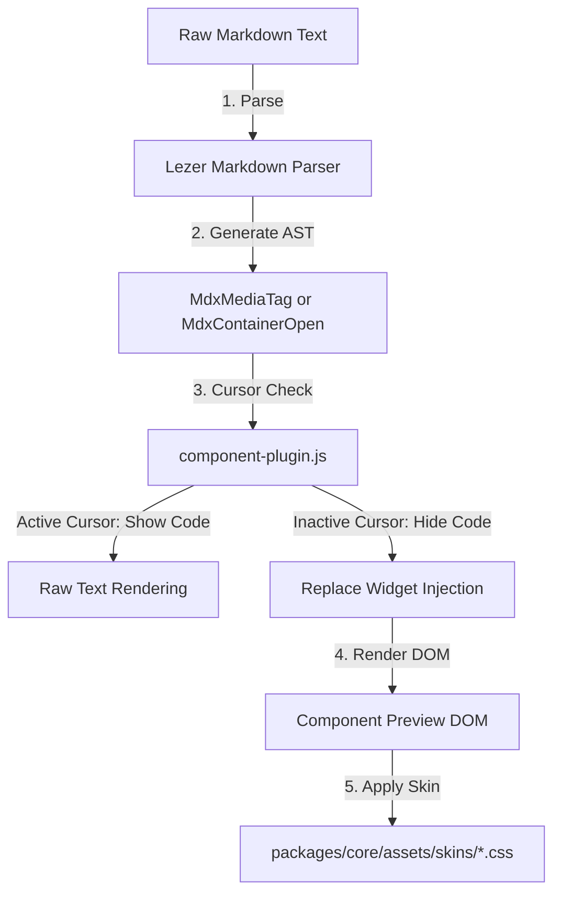

# Custom MDX Components Architecture & Blueprint

Outlining the technical blueprint for adding capitalized MDX tags (e.g. `<Gallery ids="1,2,3" />` or `<Trumpet content="description" />`) to the Traven WYSIWYM Markdown Editor.

---

## 1. Architectural Roles & Separation of Concerns

Integrating custom components follows the established decoupling between editor logic (parsing) and theme aesthetics (styling).



### A. Parser Logic (`packages/core/src/mdx-parser.js`)
* **Detection & AST Mapping**: Standard Markdown syntax trees (via `@lezer/markdown`) do not recognize JSX-style components. Traven extends the Lezer parser so `<` followed by an uppercase letter (`<[A-Z]\w*`) becomes a first-class AST node: `MdxMediaTag` for self-closing tags, or `MdxContainerOpen` / `MdxContainerClose` for paired tags. Lowercase HTML (`<video>`, `<image>`) is left to CommonMark.
* **State Management**: `component-plugin.js` tracks whether the cursor is inside the tag range.
* **Interactive Hiding**: When the cursor is outside, it collapses the tag using `Decoration.replace({})` and mounts a CodeMirror replacement `WidgetType`. When the cursor enters the tag, the raw source is revealed for editing.

### B. Rich Previews (`src/plugins/component-plugin.js`)
* **Replace Widgets**: CodeMirror `WidgetType` classes represent components visually (e.g. `ImageShortcodeWidget`, `ComponentShortcodeWidget`).
* **Interactive DOM**: These widgets return DOM nodes representing the component output. They can fetch media previews asynchronously or display placeholder cards.

### C. Skins & Themes (`packages/core/assets/skins/*.css`)
The DOM elements rendered by the widgets are assigned semantic classes (e.g. `.cm-wysiwym-component`, `.cm-wysiwym-image-container`). These are the current widget and preview class names; do not churn them when adding a new tag.
* **Skin Decoupling**: The CSS skins handle color palettes, border styling, transition animations, and shadow treatments.

---

## 2. Step-by-Step Implementation Strategy

Built-in tags (`Image`, `Video`, `Audio`, `Quote`, `Callout`, `Figure`, `Component`) are already tokenized by `mdx-parser.js`. To add a **new capitalized tag** that should fold into a widget:

### Step 1: Rely on the MDX tokenizer
Any well-formed `<MyTag … />` or `<MyTag>…</MyTag>` is already an AST node. You do **not** add a bracket regex scanner. Confirm the tag starts with `[A-Z]`.

### Step 2: Mount a widget in `component-plugin.js`
In the plugin's decoration pass, branch on `tagName` and replace the node range when the cursor is outside:

```javascript
if (lower === "gallery") {
  decorations.push({
    from,
    to,
    deco: Decoration.replace({
      widget: new GalleryWidget(attrs, from, rawText),
      block: true,
    }),
  });
  return;
}
```

### Step 3: Creating the Interactive Widget
Implement the widget subclass:

```javascript
class GalleryWidget extends WidgetType {
  constructor(attrs, pos, rawText) {
    super();
    this.attrs = attrs;
    this.pos = pos;
    this.rawText = rawText;
  }

  toDOM() {
    const container = document.createElement("div");
    container.className = "cm-wysiwym-component";
    container.innerHTML = `
      <div class="component-header">
        <span class="component-title">GALLERY</span>
      </div>
      <div class="component-body">
        <code>${this.attrs.ids || ""}</code>
      </div>
    `;
    return container;
  }
}
```

### Step 4: Preview HTML
If `getContentHtml()` should emit custom markup, handle the tag in `src/renderer/default-renderers.js` (`MdxMediaTag` / `MdxContainerTag` / Open+Close). Otherwise the generic component card is used.

---

## 3. Styling Token Roadmap

To support skinning, skins should declare definitions for the following selectors (current class names; do not churn them when adding a new tag):

```css
/* Base container for component widgets */
.cm-wysiwym-component {
  border-radius: 8px;
  padding: 12px 16px;
  font-family: inherit;
  margin: 8px 0;
}

/* Neutral Skin Definitions */
.neutral-theme-scope .cm-wysiwym-component {
  background-color: #f8fafc;
  border: 1px solid #cbd5e1;
  color: #475569;
}

/* Colorful Skin Definitions */
.colorful-theme-scope .cm-wysiwym-component {
  background-color: #fff0e8; /* Rust wash tint */
  border: 1px dashed #cc4a0a; /* Rust accent dashed border */
  color: #a83808;
}
```

---

## 4. Built-in Component: `<Image />`

Traven features a native `<Image />` tag supporting advanced alignment, sizing, alt text, captions, and custom CSS classes:

```mdx
<Image src="photo.jpg" align="right" size="medium" alt="Screen reader text" caption="Visible caption text" class="shadow-lg" />
```

### Key Integration Points
* **Fully backwards-compatible**: Optional. Standard Markdown `` continues to parse, render, and compile.
* **Separation of presentation**: In fallback HTML (`getContentHtml()`), the tag compiles to a semantic `` with **no inline style attributes**. Layout maps to class selectors (`.align-[alignment]`, `.size-[size]`, `.traven-image`) in the theme CSS/skins.
* **Toolbar insert toggle**: The image modal switches between Advanced mode (`<Image … />` with caption, classes, alignment, and size) and Legacy mode (``).
* **Lezer parser**: Attributes are parsed by `src/mdx-parser.js` into `MdxMediaTag` with `MdxAttribute` children, so delimiter-skip can jump tag boundaries during arrow navigation.
