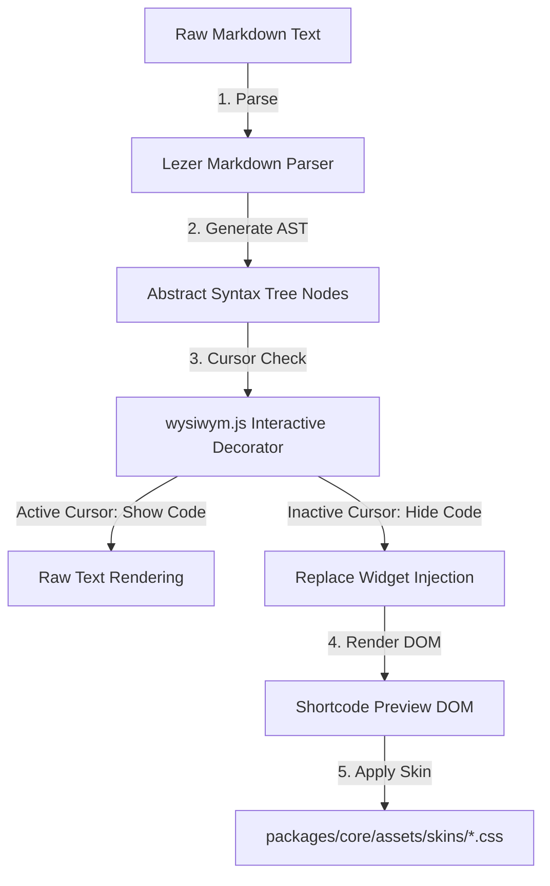

# Custom Shortcodes Architecture & Blueprint

Outlining the technical blueprint for adding custom shortcode support (e.g., `[gallery ids="1,2,3"]` or `[trumpet content="description"]`) to the Traven WYSIWYM Markdown Editor.

---

## 1. Architectural Roles & Separation of Concerns

Integrating custom shortcodes follows the established decoupling between editor logic (parsing) and theme aesthetics (styling).



### A. Parser Logic (`packages/core/src/wysiwym.js`)
* **Detection & AST Mapping**: Standard Markdown syntax trees (via `@lezer/markdown`) do not recognize custom shortcodes. Traven extends the Lezer parser with grammar extensions (e.g. `src/shortcode-parser.js`) to parse them into first-class AST nodes. `wysiwym.js` then traverses these AST nodes to identify shortcode blocks.
* **State Management**: It tracks if the cursor is currently inside a shortcode's range.
* **Interactive Hiding**: When the cursor is outside, it collapses the shortcode syntax markers using `Decoration.replace({})` and mounts a CodeMirror replacement `WidgetType`. When the cursor enters the shortcode, the raw source string is instantly revealed for editing.

### B. Rich Previews (`src/widgets/*.js`)
* **Replace Widgets**: CodeMirror `WidgetType` classes will represent the shortcodes visually (e.g., `GalleryShortcodeWidget`, `YoutubeShortcodeWidget`).
* **Interactive DOM**: These widgets return DOM nodes representing the shortcode's output. They can fetch media previews asynchronously or display interactive UI elements (like placeholder cards).

### C. Skins & Themes (`packages/core/assets/skins/*.css`)
The DOM elements rendered by the widgets are assigned semantic classes (e.g., `.cm-wysiwym-shortcode-widget`, `.cm-wysiwym-gallery-preview`).
* **Skin Decoupling**: The CSS skins handle color palettes, border styling, transition animations, and shadow treatments:
  - **Neutral Skin**: Renders the shortcode preview as a flat, distraction-free container with gray slate borders (`#cbd5e1`) and a clean background (`#f8fafc`).
  - **Colorful Skin**: Renders the shortcode preview with custom brand borders, colorful icon highlights, and transition effects.

---

## 2. Step-by-Step Implementation Strategy

### Step 1: Scanner in `wysiwym.js`
Create a helper function to find shortcodes in the document state:
```javascript
function findShortcodes(state) {
  const shortcodes = [];
  const text = state.doc.toString();
  // Regex matches bracketed shortcodes: [name key="val"]
  const regex = /\[([a-z_-]+)\s+([^\]]+)\]/g;
  let match;
  while ((match = regex.exec(text)) !== null) {
    shortcodes.push({
      name: match[1],
      rawAttrs: match[2],
      from: match.index,
      to: match.index + match[0].length
    });
  }
  return shortcodes;
}
```

### Step 2: Decorating Shortcode Elements
During decoration generation inside `wysiwym.js`:
```javascript
const shortcodes = findShortcodes(state);
for (const sc of shortcodes) {
  const isCursorInside = cursorHead >= sc.from && cursorHead <= sc.to;
  if (!isCursorInside) {
    // Inject the custom visual preview widget
    collected.push({
      from: sc.from,
      to: sc.to,
      deco: Decoration.replace({
        widget: new ShortcodeWidget(sc.name, sc.rawAttrs),
        block: true
      })
    });
  }
}
```

### Step 3: Creating the Interactive Widget
Implement the widget subclass:
```javascript
class ShortcodeWidget extends WidgetType {
  constructor(name, attrs) {
    super();
    this.name = name;
    this.attrs = attrs;
  }

  toDOM() {
    const container = document.createElement("div");
    container.className = `cm-wysiwym-shortcode-widget cm-wysiwym-shortcode-${this.name}`;
    
    // Add visual details (like an icon and properties tag)
    container.innerHTML = `
      <div class="shortcode-header">
        <span class="shortcode-icon">⚡</span>
        <span class="shortcode-title">${this.name.toUpperCase()} SHORTCODE</span>
      </div>
      <div class="shortcode-body">
        <code>${this.attrs}</code>
      </div>
    `;
    return container;
  }
}
```

---

## 3. Styling Token Roadmap

To support skinning, skins should declare definitions for the following selectors:

```css
/* Base Container for all shortcodes */
.cm-wysiwym-shortcode-widget {
  border-radius: 8px;
  padding: 12px 16px;
  font-family: inherit;
  margin: 8px 0;
}

/* Neutral Skin Definitions */
.neutral-theme-scope .cm-wysiwym-shortcode-widget {
  background-color: #f8fafc;
  border: 1px solid #cbd5e1;
  color: #475569;
}

/* Colorful Skin Definitions */
.colorful-theme-scope .cm-wysiwym-shortcode-widget {
  background-color: #fff0e8; /* Rust wash tint */
  border: 1px dashed #cc4a0a; /* Rust accent dashed border */
  color: #a83808;
}

---

## 4. Built-in Shortcode: Custom Image

Traven features a native, built-in custom `[image]` shortcode supporting advanced alignment, sizing, alt text, captions, and custom CSS classes:

```markdown
[image src="photo.jpg" align="right" size="medium" alt="Screen reader text" caption="Visible caption text" class="shadow-lg"]
```

### Key Integration Points
* **Fully Backwards-Compatible**: The custom shortcode is completely optional. Traven remains fully backwards-compatible and non-breaking for standard legacy Markdown syntax (``). Traditional Markdown image declarations parse, render, and compile exactly as they did previously.
* **Separation of Presentation Concerns**: In fallback HTML previews and rendering (`getContentHtml()`), the shortcode compiles to a clean, semantic `` element with **no inline style attributes**. Layout attributes (like width, float, margins) are mapped exclusively to class selectors (`.align-[alignment]`, `.size-[size]`, and `.traven-image-shortcode`) managed in the theme CSS/skins.
* **Toolbar Insert Toggle**: The image insertion modal contains a sliders-icon toggle to switch between Advanced mode (inserting custom `[image]` shortcodes with fields for caption, classes, alignment, and size) and Legacy mode (inserting standard `` Markdown).
* **Lezer Parser Integration**: Attributes are parsed directly using a custom inline Lezer parser (`src/shortcode-parser.js`) creating a structured AST node representation. This allows the editor to skip delimiter syntax boundaries cleanly during arrow navigation.
```
