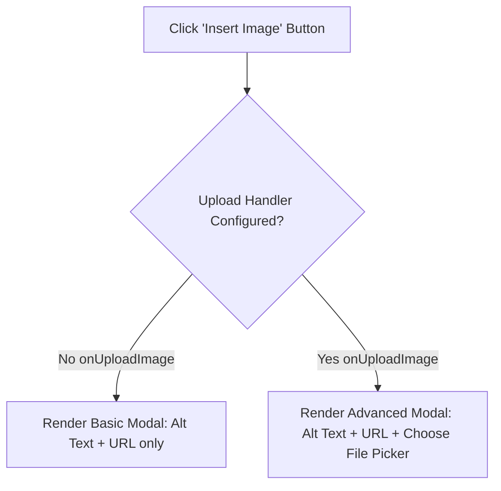

# Image Handling & Upload Customization Guide

How the Traven WYSIWYM Markdown Editor handles images and how host application developers can customize the editor to support direct drag-and-drop, paste-to-upload, and the "Choose File" option inside the Image Modal.

---

## 1. Image Insertion Methods

Traven supports two main ways to insert images:
1. **Direct Image URL**: Paste a URL link to a remote or self-hosted image.
2. **File Upload**: Choose a local file via the system file dialog, drag it directly into the editing area, or paste it from the clipboard.

Every insertion can generate either standard Markdown image syntax (``) or Traven's custom `[image]` shortcode. Traven remains fully backwards-compatible and non-breaking for standard Markdown image syntax, making the custom shortcode completely optional.

The "Insert Image" toolbar button dynamically adjusts its user interface depending on whether the host application supports file uploads.

---

## 2. Dynamic Image Modal Adaptation

To keep the editor lightweight and adaptable, the file upload picker is only shown if the host application explicitly configures an upload handler.



### A. Basic Mode (No Upload Handler)
If no image upload callback is provided, the modal provides fields for **Alt Text** and **Image URL**. Users must host their images elsewhere and paste the URL.

### B. Advanced Mode (Upload Handler Configured)
If an upload handler is configured, the modal expands to show an interactive drag-and-drop dropzone labelled **"Or Upload a File"**. 
* **Drag-and-Drop / Browse**: Authors can drag an image file directly from their OS explorer and drop it onto the dropzone, or click the dropzone anywhere to open the system file explorer.
* **Selection Preview**: Dropping or selecting a file transitions the dropzone to show a thumbnail preview, file name, and a **"Remove"** link button.
* **Input Disabling**: The URL input field is temporarily disabled when a file is selected to prevent conflicting image sources.
* **Removal**: Clicking the **"Remove"** link resets the dropzone back to the empty dropzone prompt state.
* **Upload Trigger**: When clicking **Insert**, the editor handles the upload asynchronously, updates the insert button to "Uploading...", and automatically inserts the resolved image Markdown once completed.

[](https://traven.dev/docs/general/images/)

---

## 3. Configuring Image Uploads

To enable uploads, pass an `onUploadImage` callback to the `TravenEditor` constructor.

### Callback Signature
The callback must accept a browser `File` object and return a `Promise` that resolves to the public URL of the uploaded image.

```typescript
onUploadImage: (file: File) => Promise<string>
```

### Integration Recipes

#### Recipe 1: Mock Uploads (Staging & Testing)
Useful for local sandboxes or demos (e.g. `demo-unified.php`):

```javascript
const mockImageUpload = async (file) => {
  console.log("Mock uploading file:", file.name);
  // Simulate network latency
  await new Promise(resolve => setTimeout(resolve, 1500));
  // Return a local Object URL for instant previewing
  return URL.createObjectURL(file);
};

const editor = new TravenEditor({
  element: document.getElementById("editor"),
  onUploadImage: mockImageUpload, // <-- Activates upload UI
  toolbar: DEFAULT_TOOLBAR
});
```

#### Recipe 2: Backend REST API Uploads (Production)
For production CMS integrations, send the file to your server endpoint using standard `FormData` and return the remote URL:

```javascript
const uploadImageToServer = async (file) => {
  const formData = new FormData();
  formData.append("image", file);

  const response = await fetch("/api/media/upload", {
    method: "POST",
    headers: {
      // Include any session/CSRF tokens here
      "X-CSRF-Token": document.querySelector('meta[name="csrf-token"]').content
    },
    body: formData
  });

  if (!response.ok) {
    const errorData = await response.json();
    throw new Error(errorData.message || "Failed to upload image.");
  }

  const data = await response.json();
  return data.url; // Resolves to the remote URL (e.g., https://cdn.example.com/uploads/photo.jpg)
};

const editor = new TravenEditor({
  element: document.getElementById("editor"),
  onUploadImage: uploadImageToServer,
  toolbar: DEFAULT_TOOLBAR
});
```

---

## 4. Drag & Drop and Clipboard Paste Support

Configuring `onUploadImage` does more than enable the file picker button inside the image modal; it also registers drop and paste listeners directly in CodeMirror.

[](https://traven.dev/docs/general/images/)

### How it works
1. **Drag and Drop**: The author drags an image file from their desktop and drops it onto the editor workspace.
2. **Copy and Paste**: The author copies an image (e.g. from an image editor or a screenshot tool) and pastes it (`Ctrl+V` / `Cmd+V`) directly into the editor text pane.
3. **Optimistic Loading Feedback**: Traven intercepts the event, generates a temporary optimistic loading state (an animated spinner widget inline at the cursor drop location), and begins uploading the file in the background.
4. **Shortcode Insertion**: Once the `onUploadImage` promise resolves, the editor replaces the loading indicator with the custom image shortcode containing explicit alignment and sizing defaults: `[image src="resolved_url" alt="filename.png" align="center" size="medium"]`. 

If the upload fails, the spinner indicator is cleanly removed, and a localized error warning is logged to prevent editor state corruption.

---

## 5. UI Styling Classes for Skins

Every element in the modal and upload workflow is assigned generic, semantic CSS classes. You can override these classes in your custom stylesheets (e.g., `packages/core/assets/skins/`) to change the styling to match your brand:

| Selector | Description |
| :--- | :--- |
| `.traven-modal` | The main container layout wrapper for modals. |
| `.traven-modal-field` | Form group wrapper for inputs. |
| `.traven-modal-label` | Text labels inside the modal. |
| `.traven-modal-input` | Text inputs (Alt Text, URL fields). |
| `.traven-modal-dropzone` | The drag-and-drop container wrapper for file uploads. |
| `.traven-modal-dropzone.is-dragover` | Applied to the dropzone when an image file is hovered over it. |
| `.traven-modal-dropzone.has-file` | Applied to the dropzone when a file has been selected/dropped. |
| `.traven-modal-dropzone-prompt` | Element enclosing the default prompt SVG icon and text. |
| `.traven-modal-dropzone-icon` | SVG icon shown in the dropzone prompt. |
| `.traven-modal-dropzone-text` | Description text shown in the dropzone prompt. |
| `.traven-modal-dropzone-preview` | Container showing the thumbnail, filename, and remove button once a file is chosen. |
| `.traven-modal-thumb-container` | Wrapper for the thumbnail preview. |
| `.traven-modal-thumb` | The `` element showing the preview thumbnail. |
| `.traven-modal-file-name` | Shows the name of the currently selected file. |
| `.traven-modal-remove-btn` | Styled button to clear/reset the selected file. |
| `.traven-modal-error` | Displays error messages when an upload fails or validation errors occur. |
| `.traven-modal-btn.btn-primary` | The "Insert" confirmation button. |
| `.traven-modal-btn.btn-primary.is-uploading` | Class applied to the Insert button during an active upload. |
| `.cm-image-loader` | Inline spinner widget injected into the text workspace during optimistic uploads. |

---

## 6. Media Asset Management (MAM) & Storage FAQ

This section answers architectural and implementation questions regarding image storage and library management in Traven.

### Q: Where are the uploaded images stored?
**A:** Traven does not store images or provide a backend storage service. When a user drags/drops, pastes, or selects a file in the dropzone, Traven calls the custom asynchronous JavaScript function (`onUploadImage`) that you define in the constructor. Your function uploads the file (to your local server, AWS S3, Cloudinary, etc.) and returns a URL. Traven simply takes that URL string and inserts it as standard Markdown: `` or as a custom image shortcode.

### Q: What backend technologies can I use for uploads?
**A:** You can use **any backend technology stack** (PHP, Node.js, Python, Ruby, Go, serverless functions, etc.). Because Traven's interface is a standard browser-based JS `Promise`, you can send the file using standard `fetch()` or `XMLHttpRequest` requests to any HTTP endpoint of your choice.

### Q: Does Traven include a built-in media library to select previously uploaded images?
**A:** No. Traven is an embeddable editor component, not a full Content Management System (CMS). Designing, indexing, searching, and hosting a database-driven Media Asset Management (MAM) interface is best handled by the hosting CMS or application shell. Traven maintains a clean separation of concerns by keeping its bundle lightweight and letting you wire your CMS's existing media library UI directly to the editor.

### Q: Is Traven's image handling fully Free and Open Source (FOSS)?
**A:** Yes, Traven is **100% FOSS**. While commercial editors (like TinyMCE or CKEditor) license their advanced drag-and-drop, dropzone, and cloud upload wrappers under paid enterprise subscriptions or restrict usage with volume caps, Traven gives you a polished, fully-integrated dropzone interface, live thumbnail previews, metadata inspection, and copy-paste hooks entirely free and open-source. Traven is MIT-licensed, so you can modify whatever you want, change anything, build on it, extend it, and freely use it in any project, commercial or non-commercial, without restrictions.

### Q: How do I handle authentication and CSRF protection for uploads?
**A:** Since your custom `onUploadImage` function runs directly within the context of the user's browser tab, it has full access to the page's cookies, storage, and DOM. You can read CSRF tokens from page meta tags and add them as custom request headers in your fetch callback, or let the browser attach authentication session cookies automatically. Refer to [Section 3's backend REST API recipe](#recipe-2-backend-rest-api-uploads-production) for a complete example.

---

## 7. Custom `[image]` Shortcode & Backwards Compatibility

Traven features a built-in custom `[image]` shortcode for modular page building:
```markdown
[image src="photo.jpg" align="right" size="medium" alt="Description" caption="Caption text" class="custom-class"]
```

### Backwards Compatibility
The custom shortcode is completely optional. Traven is fully backwards-compatible and will not break existing content that uses standard Markdown image declarations (``). Both syntaxes are supported simultaneously.

### Toggle Modal Option
The Image Insertion Modal features a sliders-icon toggle button to switch between:
- **Advanced settings mode**: Inserts custom `[image]` shortcode syntax and reveals settings for caption, custom CSS class, alignment, and size.
- **Legacy mode**: Inserts standard `` Markdown and disables the advanced layout inputs.

### CSS Styling & Theme Separation
When parsing `[image]` shortcodes, the fallback HTML renderer generates clean semantic `` tags with zero inline styling attributes:
```html

```
All layout styles (display type, margin, floats, width) are delegated entirely to the skin stylesheets (e.g., `skin-light.css`, `skin-dark.css`, `skin-colorful.css`, `skin-modern.css`) via these CSS selector classes.

