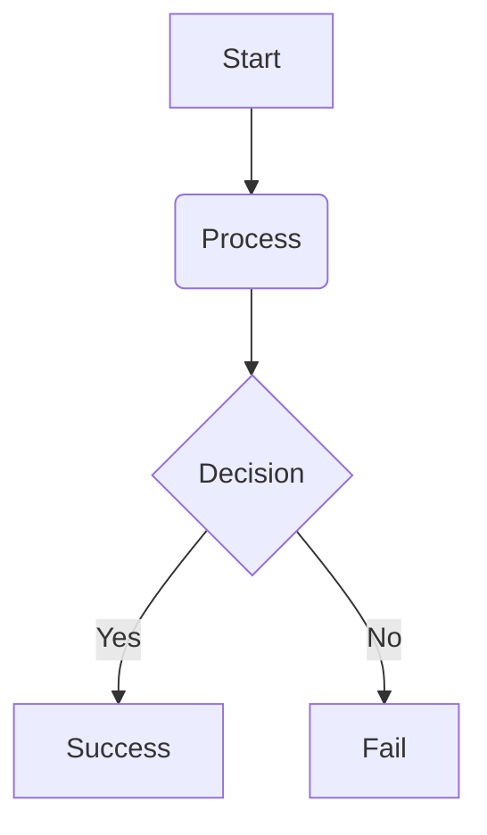

# Mermaid Diagram Support & Render Integration

Traven supports dynamic, visual rendering of Mermaid diagrams inside both the **WYSIWYM Editor** and the **HTML Preview** panel. Like LaTeX support, Mermaid is designed as an optional, lazy-loaded feature to keep the core `traven.js` bundle small and light.

---

## 1. How Mermaid Support Works

You can write diagrams using standard fenced code blocks with the `mermaid` language tag:

````markdown

````

In the editor:
* **Interactive Rendering**: When the cursor is outside the diagram block, the raw code is replaced with a rendered SVG diagram.
* **Instant Edit Access**: Clicking on the diagram swaps it back to raw text so you can edit it.
* **Fallback Mode**: If Mermaid is disabled or cannot load, it falls back to a standard syntax-highlighted code block.

---

## 2. API Configuration

To enable and configure Mermaid, use the global `TravenEditor.configureMermaid` static method.

### Option A: Standard CDN Loading (Recommended)
Pass `true` to load the default ES module build of Mermaid from jsDelivr:

```javascript
import { TravenEditor } from "./dist/traven.js";

// Enable Mermaid with default CDN (v11.4.0)
TravenEditor.configureMermaid(true);
```

### Option B: Custom CDN URL
You can specify a custom CDN URL by passing a string:

```javascript
import { TravenEditor } from "./dist/traven.js";

// Enable with a custom CDN URL
TravenEditor.configureMermaid("https://cdn.jsdelivr.net/npm/mermaid@11.4.0/dist/mermaid.esm.min.mjs");
```

### Option C: Object Configuration
You can also pass a configuration object:

```javascript
import { TravenEditor } from "./dist/traven.js";

TravenEditor.configureMermaid({
  js: "https://my-cdn.com/mermaid.esm.js"
});
```

---

## 3. HTML Preview Integration

When using the editor in a multi-pane layout (like `demo-unified.php`), you need to trigger diagram rendering on the preview container whenever the HTML is updated.

Use the static `TravenEditor.initMermaid` method:

```javascript
const htmlContent = editor.getContentHtml();
previewContainer.innerHTML = htmlContent;

// Trigger Mermaid layout engine on the preview container
TravenEditor.initMermaid(previewContainer);
```

---

## 4. Custom Styling & Themes

You can customize the appearance of the rendered WYSIWYM diagrams by targeting the following CSS classes:

```css
/* Styling for the diagram container in the editor */
.cm-wysiwym-mermaid-container {
  margin: 16px auto;
  padding: 0;
  background-color: transparent !important;
  border: none !important;
  display: flex;
  justify-content: center;
  align-items: center;
  cursor: pointer;
}

/* Styling for rendering error messages */
.mermaid-error-message {
  color: #ef4444;
  font-size: 0.85em;
  margin-top: 8px;
}
```
