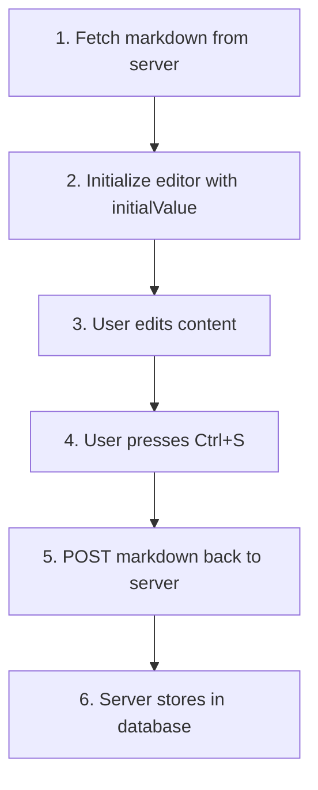

# Manual Saving & Auto-Save Customization Guide

How Traven saves content: How to intercept manual saving keyboard shortcuts and how to implement auto-saving patterns using change hooks.

---

## 1. Saving Philosophy

To maintain a clean separation of concerns, Traven does not make direct database writes or communicate with backend API storage endpoints itself. The server infrastructure, authentication details, and database queries are entirely owned by the host application or CMS.

Instead, Traven provides standard, highly customizable event listeners and callbacks that intercept user save commands (`Ctrl+S` / `Cmd+S`) and document modifications. 

---

## 2. Manual Saving (`Ctrl+S` / `Cmd+S`)

By default, Traven registers a keyboard event handler that intercepts manual saving shortcuts.
* When a user presses `Ctrl+S` (Windows/Linux) or `Cmd+S` (macOS), Traven prevents the browser's default "Save Page As..." dialog from opening.
* It extracts the current Markdown document content and triggers the save handlers.

You can intercept this event in two ways.

### A. Constructor Callback (`onSave`)
Provide an `onSave` callback function when instantiating the editor:

```javascript
const editor = new TravenEditor({
  element: document.getElementById("editor"),
  initialValue: "# Hello World",
  onSave: (markdown) => {
    console.log("Save triggered!");
    saveContentToBackend(markdown);
  }
});
```

### B. Event Listener (`save` Event)
Alternatively, bind a listener to the custom `save` event on the editor instance:

```javascript
const editor = new TravenEditor({
  element: document.getElementById("editor")
});

editor.on("save", (markdown) => {
  saveContentToBackend(markdown);
});
```

---

## 3. Auto-Saving (`onChange`)

For a modern writing experience, host applications often implement background auto-saving to save drafts. Rather than saving to the database on every single keystroke—which could bottleneck your server—you should utilize a **debounced change callback**.

A debounced function ensures that the auto-save action is delayed until the user pauses typing for a specified duration (e.g., 2 seconds).

### Integration Recipe: Debounced Auto-Save

Below is a complete recipe showing how to configure debounced auto-saving inside your CMS:

```javascript
// 1. Define a standard debounce utility
function debounce(func, delay = 2000) {
  let timeoutId;
  return (...args) => {
    clearTimeout(timeoutId);
    
    // Optional: Update your UI to show a "Saving draft..." indicator
    updateStatusIndicator("Typing...");
    
    timeoutId = setTimeout(() => {
      func.apply(null, args);
    }, delay);
  };
}

// 2. Define the save logic that communicates with your server
async function performAutoSave(content) {
  updateStatusIndicator("Saving draft...");
  try {
    const response = await fetch("/api/content/save-draft", {
      method: "POST",
      headers: {
        "Content-Type": "application/json",
        "X-CSRF-Token": getCsrfToken()
      },
      body: JSON.stringify({ markdown: content })
    });
    
    if (response.ok) {
      updateStatusIndicator("Draft saved");
    } else {
      updateStatusIndicator("Error saving draft", true);
    }
  } catch (error) {
    updateStatusIndicator("Connection lost", true);
  }
}

// 3. Initialize the debounced auto-save function
const debouncedAutoSave = debounce(performAutoSave, 2000);

// 4. Instantiate Traven and bind the onChange callback
const editor = new TravenEditor({
  element: document.getElementById("editor"),
  onChange: (content) => {
    debouncedAutoSave(content);
  }
});

// UI feedback helper
function updateStatusIndicator(message, isError = false) {
  const statusEl = document.getElementById("save-status");
  if (statusEl) {
    statusEl.textContent = message;
    statusEl.style.color = isError ? "#ef4444" : "#64748b";
  }
}
```

---

## 4. Complete Round-Trip: Load → Edit → Save

The most common integration question is: *"How do I load existing content from my database, let the user edit it, and save it back?"* Below is a complete, self-contained recipe showing every step in the lifecycle.

### The Full Flow



### HTML Page

```html
<!DOCTYPE html>
<html lang="en">
<head>
  <meta charset="UTF-8">
  <title>Edit Post</title>
  <meta name="csrf-token" content="YOUR_CSRF_TOKEN">
</head>
<body>

  <div style="display: flex; justify-content: space-between; align-items: center; margin-bottom: 12px;">
    <h1>Editing: <span id="post-title"></span></h1>
    <span id="save-status" style="color: #64748b; font-size: 0.9em;">Ready</span>
  </div>

  <div id="editor-mount"></div>

  <script type="module">
    import { TravenEditor, DEFAULT_TOOLBAR } from "https://cdn.jsdelivr.net/npm/@freedomware/traven@latest/dist/traven.js";

    // ─── Step 1: Fetch existing content from your API ───
    const postId = new URLSearchParams(window.location.search).get("id");
    const response = await fetch(`/api/posts/${postId}`);
    const post = await response.json();

    // Populate the page title
    document.getElementById("post-title").textContent = post.title;

    // ─── Step 2: Initialize the editor with the loaded content ───
    const editor = new TravenEditor({
      element: document.getElementById("editor-mount"),
      initialValue: post.content,          // ← loaded from database
      toolbar: DEFAULT_TOOLBAR,
      // ─── Step 3: Intercept manual save (Ctrl+S / Cmd+S) ───
      onSave: async (markdown) => {
        const statusEl = document.getElementById("save-status");
        statusEl.textContent = "Saving...";
        statusEl.style.color = "#64748b";

        try {
          // ─── Step 4: POST the updated markdown back to your API ───
          const res = await fetch(`/api/posts/${postId}`, {
            method: "PUT",
            headers: {
              "Content-Type": "application/json",
              "X-CSRF-Token": document.querySelector('meta[name="csrf-token"]').content
            },
            body: JSON.stringify({ content: markdown })
          });

          if (res.ok) {
            statusEl.textContent = "Saved";
            statusEl.style.color = "#22c55e";
          } else {
            statusEl.textContent = "Save failed";
            statusEl.style.color = "#ef4444";
          }
        } catch (err) {
          statusEl.textContent = "Connection lost";
          statusEl.style.color = "#ef4444";
        }
      }
    });
  </script>
</body>
</html>
```

### Server Endpoint (Express.js example)

Any backend works — the pattern is identical in PHP, Django, Rails, etc. The key is that the API returns `content` as a raw Markdown string on GET, and accepts it back on PUT:

```javascript
// GET /api/posts/:id  →  Load
app.get("/api/posts/:id", async (req, res) => {
  const post = await db.posts.findById(req.params.id);
  res.json({ title: post.title, content: post.body_markdown });
});

// PUT /api/posts/:id  →  Save
app.put("/api/posts/:id", async (req, res) => {
  await db.posts.update(req.params.id, {
    body_markdown: req.body.content   // ← raw Markdown string from Traven
  });
  res.json({ ok: true });
});
```

### PHP Equivalent (No Framework)

If you are using plain PHP without a JavaScript API layer, Traven submits through a standard HTML `<form>` just like a `<textarea>`. No `fetch()` needed:

```html
<form action="save-post.php" method="POST">
  <input type="hidden" name="post_id" value="42">
  <traven-editor name="content" toolbar><?php echo htmlspecialchars($existingMarkdown); ?></traven-editor>
  <button type="submit">Save</button>
</form>

<script type="module" src="https://cdn.jsdelivr.net/npm/@freedomware/traven@latest/dist/traven.js"></script>
```

```php
<?php
// save-post.php
$postId = $_POST['post_id'];
$markdown = $_POST['content'];  // ← raw Markdown, just like a textarea

// Store in database...
$stmt = $pdo->prepare("UPDATE posts SET body_markdown = ? WHERE id = ?");
$stmt->execute([$markdown, $postId]);

header("Location: /edit-post.php?id=" . $postId);
```

---

## 5. Summary of API Hooks

| Method / Option | Hook Type | Trigger Description |
| :--- | :--- | :--- |
| `options.onSave` | Constructor Option | Fires a function with the current editor content when `Ctrl+S` / `Cmd+S` is pressed. |
| `.on("save", callback)` | Event Listener | Triggers listeners with the current editor content when `Ctrl+S` / `Cmd+S` is pressed. |
| `options.onChange` | Constructor Option | Fires a function with the current editor content on every document change. |
| `.on("change", callback)` | Event Listener | Triggers listeners with the current editor content on every document change. |
