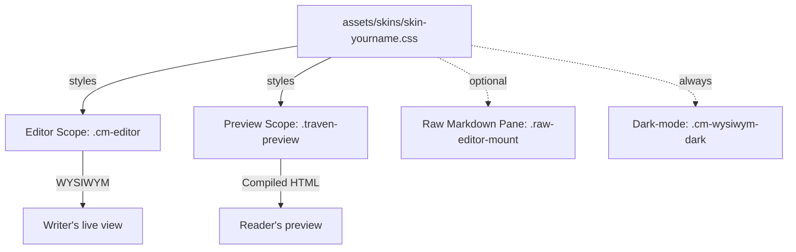

# Traven Editor — Theme Development Guide

This guide is for theme designers, UI/UX designers, and front-end engineers who want to build Traven themes from scratch, customize an existing skin, or ship a Traven-aware theme for a CMS or static site.

Traven's skinning model is intentionally decoupled: themes are **plain CSS files** with no JavaScript and no build step. The editor engine and the shortcode widgets are class-driven, so every visual decision — fonts, colors, borders, spacing, alignment, and dark-mode behavior — lives in your theme. The trade-off is that the WYSIWYM (live) editor and the HTML preview share the same content but use **two different DOM scopes**, and a complete theme must style both.

This document is a comprehensive guide to styling Traven, detailing the side-by-side skin comparisons, the canonical selector reference, a "what every theme must include" QA checklist, and recipes for styling elements in both the editor and preview DOM scopes (including the raw Markdown pane, Vim's fat cursor, scrollbars, and LaTeX math widgets).

---

## 1. Mental model: two scopes, one CSS file

A Traven skin is a single `.css` file that targets **two cooperating DOM trees** rendered by the same editor:



1. **Editor scope (`.cm-editor`)** — the live WYSIWYM canvas. Traven translates Markdown tokens into visual elements using CodeMirror 6 decorations. Live editor classes are prefixed with `.cm-wysiwym-*` (for example `.cm-wysiwym-bold`, `.cm-wysiwym-blockquote`, `.cm-wysiwym-inline-code`).
2. **Preview scope (`.traven-preview`)** — the compiled HTML output displayed in the preview pane. It is styled using normal native HTML selectors nested inside the wrapper class (for example `.traven-preview h1`, `.traven-preview blockquote`, `.traven-preview img`).
3. **Raw editor scope (`.raw-editor-mount`)** — optional split-pane that shows raw Markdown source. Most themes restyle the raw pane to use a monospace font.
4. **Dark mode** — controlled by the `.cm-wysiwym-dark` class on the editor host node (and the preview container, when present). See [§7](#7-dark-mode) for details.

> [!IMPORTANT]
> A complete theme styles **both** the editor and the preview. If a heading looks right in the live editor but cropped in the preview, or vice-versa, the writer will assume the theme is broken.

---

## 2. The five shipping skins, side by side

All five skins live in `assets/skins/` and are auto-discovered by the customization dropdown (`includes/_customization-dropdowns.php`); any new file you add to that directory shows up in the demo page's skin picker with no further wiring.

| Skin | Design intent | Body font | Mono font | Gutter | Headings | Caret | Accent |
| :--- | :--- | :--- | :--- | :--- | :--- | :--- | :--- |
| `skin-default.css` | Neutral Slate — baseline | `Atkinson Hyperlegible Next` → system stack | `Fira Code` → monospace | Visible, soft slate | Bold sans, tight | Slate 900 | Slate 600 |
| `skin-colorful.css` | Warm Rust — expressive | `Atkinson Hyperlegible Next` | `Fira Code` | Visible, indigo active | Bold sans, bright rust caret | `#cc4a0a` rust | `#3b82f6` indigo |
| `skin-dark.css` | Premium Dark Slate | `Atkinson Hyperlegible Next` | `Fira Code` | Visible, dim slate | Bold sans, near-white | Sky `#38bdf8` | Sky `#38bdf8` |
| `skin-editorial.css` | Minimalist Focus — no chrome | `Goudy Bookletter 1911` (serif) | `Victor Mono` | **Hidden** | `Macondo` (h1–h3), Goudy (h4–h6) | Ink black | None — pure paper |
| `skin-modern.css` | Modern Clean — premium | `Epunda Slab` (serif) | `JetBrains Mono` | Visible, borderless | `Saira Condensed` (sans) | Zinc 900 | `#115e59` teal |

Other dimensions worth knowing:

* **External requests.** `skin-default.css` and `skin-dark.css` load zero web fonts. `skin-colorful.css`, `skin-editorial.css`, and `skin-modern.css` `@import` from Google Fonts by default. See [§10](#10-telemetry--offline-self-hosting) for how to switch a skin to local fonts.
* **First-load fonts.** `skin-default.css` and `skin-dark.css` declare `'Atkinson Hyperlegible Next'` in the stack but the file itself does not import it. The host page is expected to load it (the demos do via `assets/fonts/fonts.css`).
* **Blockquote treatment.** The `skin-default`, `skin-colorful`, `skin-dark`, and `skin-modern` themes use a thick left bar. The `skin-editorial` theme uses a decorative `::before` curly-quote mark, with the wavy line dividers on pullquotes.
* **Info / warning cards.** The `skin-default`, `skin-colorful`, `skin-dark`, and `skin-modern` themes render these as soft rounded/bordered cards. The `skin-editorial` theme uses the "hand-drawn" organic border-radius (`255px 15px 225px 15px / 15px 225px 15px 255px`) for a handcrafted look.
* **Pullquote dividers.** Only the `skin-editorial` theme renders the decorative wave SVG above and below `.traven-component-pullquote`; the other themes use simple top/bottom rules.

When in doubt, copy the theme that is closest to your goal and patch its variables.

---

## 3. The selector reference

The list below covers every selector a complete theme should consider. Anything in **bold** is required; anything in *italics* is optional but recommended; the rest is "if the feature is visible in your demo, style it."

### 3.1 Editor scope — `.cm-editor`

#### Chrome
| Selector | Required? | Notes |
| :--- | :--- | :--- |
| `.cm-editor` | **Yes** | Base wrapper. Set `font-family`, `background-color`, `color`. |
| `.cm-editor:focus`, `.cm-editor.cm-focused` | Recommended | Strip the default focus ring. |
| `.cm-scroller` | Recommended | Inner scroll viewport. Inherit font, set `line-height` and vertical padding. |
| `.cm-content` | Recommended | Sets horizontal padding (typical: `0 24px`). |
| `.cm-line` | Optional | General line. **Never** apply `padding: 0` here unless you also re-pad every heading variant. |
| `.cm-gutters`, `.cm-gutterElement` | Optional | Line-number column. Hide with `display: none !important` for a paper feel. |
| `.cm-activeLine` | Optional | Soft tint of the active line. |
| `.cm-activeLineGutter` | Optional | Active line indicator in the gutter. |
| `.cm-selectionBackground`, `.cm-native-selection` | **Yes** | Selection highlight. The focused variant uses `.cm-editor.cm-focused > .cm-scroller > .cm-selectionLayer .cm-selectionBackground`. |
| `.cm-cursor` | **Yes** | Caret color. |
| `.cm-fat-cursor` | **Yes** | Vim Normal-mode block cursor. Always set `opacity: 0.6 !important` so the character underneath is readable. |
| Scrollbars: `.cm-editor ::-webkit-scrollbar*` | Optional | Skinnable per theme. |

#### Inline marks (all required)
| Selector | Purpose |
| :--- | :--- |
| `.cm-wysiwym-bold` | Bold text |
| `.cm-wysiwym-italic` | Italic text |
| `.cm-wysiwym-strikethrough` | ~~strikethrough~~ |
| `.cm-wysiwym-highlight` | `==highlight==` mark |
| `.cm-wysiwym-inline-code` | `` `inline code` `` pill |
| `.cm-wysiwym-link-anchor` | Live link anchor (Ctrl/Cmd-click) |
| `.cm-wysiwym-bullet` | Custom list bullet glyph |
| `cmt-heading`, `tok-heading`, `span` inside `.cm-wysiwym-h1`–`h6` | Strip any default underline from the highlighter. |

#### Block-level live elements
| Selector | Purpose |
| :--- | :--- |
| `.cm-wysiwym-h1` … `.cm-wysiwym-h6` | Live heading lines (one class per level). **Use `padding` (not `margin`) and add `!important`.** |
| `.cm-wysiwym-blockquote` | Live blockquote lines. Use the `:has()` sibling selectors (see [§4.2](#42-blockquotes-and-the-has-trick)) to style first, middle, and last lines. |
| `.cm-wysiwym-frontmatter` | YAML frontmatter block. |
| `.cm-wysiwym-frontmatter-active` | Active frontmatter line (the one the cursor is on). |
| `.cm-wysiwym-hr-widget` | Horizontal rule replacement. |
| `.cm-wysiwym-codeblock-line` | One line inside a fenced code block. Use `-first` / `-last` modifiers for rounded corners. |
| `.cm-wysiwym-collapsed-fence` | A fence line whose text is hidden but the empty container still occupies space. **Set `height: 0 !important`.** |
| `.cm-wysiwym-image-widget-container` | Legacy plain `` Markdown image widget. |
| `.cm-wysiwym-image-shortcode-container` | Advanced `[image ...]` shortcode widget. Same alignment helpers (`.align-left`, etc.) as the preview. |
| `.cm-wysiwym-image-caption` | Caption text under the legacy image widget. |
| `.cm-wysiwym-image-shortcode-container .shortcode-meta` | The meta row under the advanced shortcode widget. |
| `.cm-wysiwym-image-shortcode-container .meta-badge` | "Tag name" pill (`[IMAGE]`, etc.). Use `.tag-name` for the first badge. |
| `.cm-wysiwym-image-uploading` | Optimistic upload pill (green dashed border). |
| `.cm-wysiwym-video-shortcode-container` | `[video]` widget. |
| `.cm-wysiwym-video-shortcode-container .video-placeholder`, `.video-placeholder-icon-wrap`, `.video-placeholder-details`, `.video-placeholder-platform`, `.video-placeholder-url` | Pieces of the video placeholder card. |
| `.cm-wysiwym-audio-shortcode-container` | `[audio]` widget, same shape as the video container. |
| `.cm-wysiwym-component-shortcode` | Generic `[component]` block, plus variants `.component-blockquote`, `.component-pullquote`, `.component-info`, `.component-warning`. |
| `.cm-wysiwym-component-shortcode .component-body` | Inner body container. |
| `.cm-wysiwym-component-shortcode .component-body p` | Paragraphs inside the body. |
| `.cm-wysiwym-component-shortcode cite` | The "— Author, Source" line on blockquote components. |
| `.cm-wysiwym-figure-shortcode` | `[figure]` widget. Contains `.component-body` and `.figure-caption`. |
| `.cm-wysiwym-table-row` | GFM table source line in raw editing mode. |
| `.cm-wysiwym-table-widget` | Rendered WYSIWYM table (when the cursor is outside). Style `.cm-wysiwym-table-widget table`, `th`, `td` normally. |
| `.cm-wysiwym-inline-math-widget` | Live LaTeX inline equation. |
| `.cm-wysiwym-block-math-widget` | Live LaTeX display equation. |
| `.katex-inline-fallback`, `.katex-display-fallback` | Fallback rendering when KaTeX is not loaded. |

#### Hover-edit icons
All block widgets have an absolute-positioned icon that appears on hover:

* `.cm-wysiwym-image-shortcode-container .image-edit-icon`
* `.cm-wysiwym-video-shortcode-container .video-edit-icon`
* `.cm-wysiwym-audio-shortcode-container .audio-edit-icon`
* `.cm-wysiwym-component-shortcode .image-edit-icon`
* `.cm-wysiwym-figure-shortcode .figure-edit-icon`

Style them like 24 × 24 px round buttons with a subtle border, hidden by `opacity: 0` and shown on `:hover` of the parent.

#### Syntax highlighting (optional)
The CodeMirror Markdown highlighter tags tokens with classes in two parallel namespaces: `tok-*` and `cmt-*`. Style both for safety. The complete list is short:

* `tok-markup` / `cmt-markup` — `*`, `_`, `~~`, `` ` `` markers
* `tok-meta` / `cmt-meta`
* `tok-punctuation` / `cmt-punctuation`
* `tok-list` / `cmt-list` — list bullet characters
* `tok-comment` / `cmt-comment` — `<!-- … -->`
* `tok-keyword` / `cmt-keyword`
* `tok-string` / `cmt-string`
* `tok-number` / `cmt-number`, `tok-boolean` / `cmt-boolean`
* `tok-variableName` / `cmt-variableName`
* `tok-propertyName` / `cmt-propertyName`
* `tok-operator` / `cmt-operator`
* `tok-url` / `cmt-url`, `tok-link` / `cmt-link`

The shipping skins style only the markdown-relevant subset (`markup`, `meta`, `punctuation`, `list`, `comment`, `keyword`, `string`, `number`). For a content-focused theme that is plenty.

### 3.2 Raw editor scope — `.raw-editor-mount`

If the host page mounts a raw Markdown pane (most demos do), the entire CodeMirror tree lives inside a `.raw-editor-mount` wrapper. The default themes override the font and line height:

```css
.raw-editor-mount .cm-editor,
.raw-editor-mount .cm-content,
.raw-editor-mount .cm-scroller,
.raw-editor-mount .cm-line {
  font-family: 'Victor Mono', Courier, monospace !important;
  font-size: 14px !important;
  line-height: 2 !important;
  background-color: transparent !important;
  color: #1a1a1a !important;
}
```

Themes that keep the same mono font as the inline code (e.g. `Fira Code`) can drop this block, but the raw pane should always use **monospace** at a slightly larger size with generous line-height for readability.

### 3.3 Preview scope — `.traven-preview`

Targets compiled HTML. Almost all of these are standard selectors nested inside `.traven-preview`.

| Selector | Maps to |
| :--- | :--- |
| `.traven-preview` | Preview wrapper. Set the base font, color, and background. |
| `.traven-preview h1` … `h6` | Compiled headings. Set sizes, weights, margins, and family. |
| `.traven-preview > h1:first-child`, `> h2:first-child`, `> h3:first-child` | First-child headings — match the editor's `padding-top` to avoid a visual jump. |
| `.traven-preview p` | Paragraphs. `line-height` and `margin-bottom` only. |
| `.traven-preview ul`, `ol`, `li` | Lists. `padding-left`, `li::marker` (color). |
| `.traven-preview blockquote:not(.traven-component-pullquote)` | Native blockquotes. (The `:not()` keeps the `[pullquote]` shortcode from picking these styles up.) |
| `.traven-preview pre`, `.traven-preview code` | Code blocks and inline code. |
| `.traven-preview a` | Links. |
| `.traven-preview mark` | `==highlight==` output. |
| `.traven-preview hr` | Horizontal rule. |
| `.traven-preview table`, `th`, `td` | GFM tables. Set `height: 38px` on `th`/`td` to keep blank cells from collapsing. |
| `.traven-preview img.traven-image-shortcode` | The advanced image shortcode, no caption. |
| `.traven-preview figure.traven-image-figure` | The advanced image shortcode, with caption. |
| `.traven-preview figure.traven-image-figure figcaption.traven-image-caption` | Caption text. |
| `.traven-preview .traven-video-container`, `figure.traven-video-figure` | `[video]` output. |
| `.traven-preview figure.traven-video-figure .traven-video-container`, `figcaption.traven-video-caption` | Inner video container + caption. |
| `.traven-preview .traven-audio-container`, `figure.traven-audio-figure` | `[audio]` output. |
| `.traven-preview .traven-audio-figure figcaption.traven-audio-caption` | Audio caption. |
| `.traven-preview .traven-component` | Generic `[component]` card wrapper. |
| `.traven-preview .traven-component-blockquote` | The `[quote]` / `[blockquote]` / `[component="blockquote"]` block. |
| `.traven-preview .traven-component-blockquote::before` | Decorative opening quote (the editorial/write themes draw it with a `::before`; default/colorful/dark omit it). |
| `.traven-preview .traven-component-blockquote footer`, `cite` | The optional citation. |
| `.traven-preview .traven-component-pullquote` | The `[pullquote]` block. Optional decorative `::before` / `::after`. |
| `.traven-preview .traven-component-info` | The `[info]` notice block. |
| `.traven-preview .traven-component-warning` | The `[warning]` notice block. |
| `.traven-preview .traven-figure` | The `[figure]` block wrapper. |
| `.traven-preview .traven-figure-caption` | The caption inside `.traven-figure`. |
| `.traven-preview .traven-figure.align-fullbleed` | Breakout. Apply the same `100vw / calc(-50vw + 50%)` trick used elsewhere. |
| `.traven-preview figure.traven-image-figure figcaption.traven-image-caption` | Caption of the `[image]` figure. |

#### Alignment helpers (shared between editor and preview)

Every shortcode accepts `align="left|right|center|fullbleed"` and `size="small|medium|large|full"`. Both the editor widget and the preview HTML emit these as classes, so a single rule typically covers both scopes:

```css
.cm-wysiwym-image-shortcode-container.align-left,
.traven-preview figure.traven-image-figure.align-left { ... }

/* Or in a combined block: */
.cm-wysiwym-image-shortcode-container,
.cm-wysiwym-video-shortcode-container,
.cm-wysiwym-audio-shortcode-container,
.cm-wysiwym-figure-shortcode {
  /* shared card chrome */
}

.size-small  { width: 150px; }
.size-medium { width: 300px; }
.size-large  { width: 600px; }
.size-full   { width: 100%; }
```

> [!WARNING]
> Inside the **editor**, alignment uses auto-margins (e.g. `margin: 0 auto 0 0 !important`). Inside the **preview**, you may use `float: left/right`. Mixing them up breaks CodeMirror's coordinate mapping. See [§4.4](#44-no-floats-or-vertical-margins-in-the-editor) for the full rule.

### 3.4 Modal dialog scope

Traven's modal overlay (link, image, video, audio, component, figure, table editor, help, etc.) is rendered in a separate overlay class `.traven-modal-overlay`. The default toolbar stylesheet (`assets/toolbars/toolbar-default.css`) handles most of the modal chrome. A theme normally only needs to override these:

* `.traven-modal-overlay` — outer backdrop.
* `.traven-modal-overlay.cm-wysiwym-dark` — dark-mode modal.
* `.traven-modal-btn.btn-primary` / `.btn-secondary` — action buttons.
* `.traven-modal-input`, `.traven-modal-textarea`, `.traven-modal-select` — form fields.
* `.traven-modal-dropzone` — drag-and-drop file zone.

If you ship a dark skin, the toolbar stylesheet's existing `.traven-modal-overlay.cm-wysiwym-dark` rules will look right if the theme's body background and text colors match the editor. If they don't, override the toolbar variables in your theme.

---

## 4. CodeMirror 6 layout-engine rules

A handful of CSS assumptions that work everywhere else on the web **break** the WYSIWYM editor. They are not bugs; they are consequences of how CodeMirror 6 measures characters and maps coordinates. Every shipping skin obeys them, and a custom theme that violates them will see cursor clicks land on the wrong lines.

### 4.1 Never use vertical margins on line elements
CodeMirror stacks `.cm-line` elements sequentially and re-measures the stack on every layout pass. A `margin-top` on a heading pushes the next line down by an amount CodeMirror does not see, so `posAtCoords` returns a stale position and clicks land above or below where the user actually clicked.

Always use `padding` and add `!important` so a generic `.cm-line { padding: 0 }` reset cannot win:

```css
.cm-editor .cm-wysiwym-h1 {
  font-size: 2em;
  font-weight: 800;
  line-height: 1.2;
  padding-top: 24px !important;
  padding-bottom: 12px !important;
  margin: 0 !important;
}
```

The same rule applies to every other block element that lives on its own line: blockquotes, code-block lines, table rows, list items, and (in [§4.4](#44-no-floats-or-vertical-margins-in-the-editor)) block widgets.

### 4.2 Blockquotes and the `:has()` trick
A blockquote in CodeMirror is rendered as **multiple** `.cm-line` siblings that all share the `.cm-wysiwym-blockquote` class. The first line needs top padding, the last line needs bottom padding, and the middle lines need neither, otherwise you get a double-thick bar at the top.

The shipping skins use:

```css
.cm-editor .cm-wysiwym-blockquote {
  padding-top: 2px !important;
  padding-bottom: 2px !important;
  padding-left: 16px !important;
  border-left: 3px solid #cbd5e1;
  margin: 0 !important;
}
/* First line of the block */
.cm-editor .cm-wysiwym-blockquote { padding-top: 10px !important; }
/* Subsequent lines in the same block */
.cm-editor .cm-wysiwym-blockquote + .cm-wysiwym-blockquote { padding-top: 2px !important; }
/* Last line of the block */
.cm-editor .cm-wysiwym-blockquote:not(:has(+ .cm-wysiwym-blockquote)) {
  padding-bottom: 10px !important;
}
```

The same trick is used in the preview: `.traven-preview blockquote:not(.traven-component-pullquote) { ... }` and the equivalent `:not(:has(+ ...))` rule for the last line.

### 4.3 Blank-line collapse after headings
A blank Markdown line directly after a heading renders as a full-height empty `.cm-line` in the editor, but the preview parser collapses it away. The shipping themes close the gap with:

```css
.cm-editor .cm-wysiwym-h1 + .cm-line:has(br:only-child),
.cm-editor .cm-wysiwym-h2 + .cm-line:has(br:only-child),
.cm-editor .cm-wysiwym-h3 + .cm-line:has(br:only-child) {
  height: 0.6em !important;
  min-height: 0.6em !important;
}
```

Apply the same pattern around blockquotes (`+ .cm-line:has(br:only-child)` before *and* after) and after code-block fences (see [§4.5](#45-fenced-code-blocks)).

### 4.4 No floats or vertical margins in the editor
Block widgets (`.cm-wysiwym-image-shortcode-container`, `.cm-wysiwym-video-shortcode-container`, `.cm-wysiwym-audio-shortcode-container`, `.cm-wysiwym-figure-shortcode`, and the component shortcode variants) are rendered as CodeMirror block decorations. CodeMirror's coordinate mapping assumes they sit in the normal document flow.

* **No `float: left` or `float: right`** — floated elements wrap text around themselves, which CodeMirror doesn't expect. The result: mouse clicks below a floated widget land on the wrong line.
* **No `margin-top` or `margin-bottom`** — same family of issues as [§4.1](#41-never-use-vertical-margins-on-line-elements).
* **Use auto-margins for horizontal alignment:**

  ```css
  .cm-wysiwym-image-shortcode-container.align-left   { margin: 0 auto 0 0 !important; }
  .cm-wysiwym-image-shortcode-container.align-right  { margin: 0 0 0 auto !important; }
  .cm-wysiwym-image-shortcode-container.align-center { margin: 0 auto !important; }
  .cm-wysiwym-image-shortcode-container.align-fullbleed {
    width: 100% !important;
    margin: 0 !important;
    border: none !important;
    border-radius: 0 !important;
  }
  ```

* **In the preview, floats are fine.** `.traven-preview img.traven-image-shortcode.align-left { float: left; ... }` works without breaking anything, because the preview is plain HTML and never goes through CodeMirror's coordinate mapper.

### 4.5 Fenced code blocks
When a fenced code block is collapsed (cursor outside), the opening and closing fence lines become empty `.cm-line` containers that still occupy vertical space. The shipping themes mark them with a `.cm-wysiwym-collapsed-fence` class and squash them:

```css
.cm-editor .cm-wysiwym-collapsed-fence {
  height: 0 !important;
  min-height: 0 !important;
  padding: 0 !important;
  margin: 0 !important;
  border: none !important;
  overflow: hidden !important;
  visibility: hidden !important;
}
```

For the first / last / middle content lines, use the `-first` / `-last` modifiers to apply rounded corners and `border` rules that stitch the block into a single visual unit.

### 4.6 Character width caching
CodeMirror measures and caches character widths on first paint. If your theme loads custom fonts asynchronously (Google Fonts, a self-hosted `font-display: swap` face, etc.), the cache can be populated with the fallback's widths and then never re-measured when the real font loads, causing cursor misalignment.

Mitigations:

* Defer editor construction until fonts are ready:

  ```javascript
  document.fonts.ready.then(() => {
    new TravenEditor({ element: document.getElementById("editor") });
  });
  ```

* Avoid `font-display: swap` for the editor's body font.
* For self-hosted fonts, preload the `.woff2` files in the `<head>` so the measurement cache is correct from the first paint.

---

## 5. WYSIWYM/Preview parity

The preview and the editor should look as similar as possible. The shipping skins accomplish this with the following patterns.

### 5.1 First-child heading margin
CodeMirror's first line is flush with the editor's top; the heading's `padding-top` provides the breathing room. In the preview, the same heading's `margin-top` is collapsed with the preview container's padding, so the first heading appears at the wrong offset unless you compensate:

```css
.cm-editor .cm-wysiwym-h1 { padding-top: 27px !important; }

.traven-preview > h1:first-child { margin-top: 27px !important; }
.traven-preview > h2:first-child { margin-top: 12px !important; }
.traven-preview > h3:first-child { margin-top: 4.5px !important; }
```

The numbers in `editorial`/`write` themes are larger because their `padding-top` values are larger; whatever you pick, the editor and the preview must agree.

### 5.2 Blockquote spacing parity
Reduce the preview's blockquote vertical neighbors with a `:has()` selector to mirror the editor's collapsed blank line:

```css
.traven-preview p:has(+ blockquote:not(.traven-component-pullquote)),
.traven-preview ul:has(+ blockquote:not(.traven-component-pullquote)),
.traven-preview pre:has(+ blockquote:not(.traven-component-pullquote)) {
  margin-bottom: 0.6em !important;
}
.traven-preview blockquote:not(.traven-component-pullquote) + p,
.traven-preview blockquote:not(.traven-component-pullquote) + pre {
  margin-top: 0.6em !important;
}
```

The same pattern is used around the `[component="blockquote"]` and `[info]`/`[warning]` blocks. (Search your theme for `:has(+ .traven-` to see them.)

### 5.3 Tables
The live table widget (`.cm-wysiwym-table-widget table`) and the preview table (`.traven-preview table`) should share the same border colors, padding, and minimum cell height. All shipping themes set `height: 38px` on `th` and `td` so that an empty cell never collapses to zero.

### 5.4 Code blocks
Match the editor's `.cm-wysiwym-codeblock-line` colors and the preview's `.traven-preview pre`. The `-first` / `-last` borders on the editor side correspond to a `border-top` / `border-bottom` on the preview `<pre>`.

---

## 6. Shortcode markup reference (cheat sheet)

The fallback renderer emits **zero inline styles**; every visual decision is delegated to your theme. This section is a copy of the canonical markup in `docs-gitignore/shortcodestyles.css`, condensed for theme authors. Use the comment blocks in that file as your authoritative reference.

### 6.1 `[image ...]`

```html
<!-- No caption -->


<!-- With caption -->
<figure class="traven-image-figure align-[alignment] size-[size] [custom]">
  
  <figcaption class="traven-image-caption">Caption</figcaption>
</figure>
```

* **Editor wrapper:** `.cm-wysiwym-image-shortcode-container`
* **Preview wrapper:** `.traven-preview img.traven-image-shortcode`, `.traven-preview figure.traven-image-figure`
* **Caption:** `figcaption.traven-image-caption`
* **Alignment:** `align-left` / `align-right` / `align-center` / `align-fullbleed`
* **Sizes:** `size-small` (~150 px), `size-medium` (~300 px), `size-large` (~600 px), `size-full` (100%)

For `align-fullbleed`, use the standard 100vw breakout:

```css
.traven-preview img.traven-image-shortcode.align-fullbleed,
.traven-preview figure.traven-image-figure.align-fullbleed {
  width: 100vw !important;
  max-width: 100vw !important;
  margin-left: calc(-50vw + 50%) !important;
  margin-right: calc(-50vw + 50%) !important;
  border-radius: 0 !important;
  display: block !important;
  float: none !important;
  clear: both !important;
}
```

### 6.2 `[video ...]`

```html
<!-- YouTube / Vimeo / direct file, no caption -->
<div class="traven-video-container align-[a] size-[s] [custom]">
  <iframe src="https://www.youtube.com/embed/..." ...></iframe>
  <!-- or: -->
  <video src="..." controls></video>
</div>

<!-- With caption -->
<figure class="traven-video-figure align-[a] size-[s] [custom]">
  <div class="traven-video-container">
    <iframe ...></iframe>  <!-- or <video> -->
  </div>
  <figcaption class="traven-video-caption">Caption</figcaption>
</figure>
```

* **Editor wrapper:** `.cm-wysiwym-video-shortcode-container` (plus `.video-placeholder`, `.video-placeholder-icon-wrap`, `.video-placeholder-details`, `.video-placeholder-platform`, `.video-placeholder-url`).
* **Preview wrapper:** `.traven-preview .traven-video-container` (16:9 `aspect-ratio`), `.traven-preview figure.traven-video-figure`.
* **Caption:** `figcaption.traven-video-caption`.

### 6.3 `[audio ...]`

```html
<div class="traven-audio-container align-[a] size-[s] [custom]">
  <audio src="..." controls></audio>
</div>

<!-- With caption -->
<figure class="traven-audio-figure align-[a] size-[s] [custom]">
  <div class="traven-audio-container">
    <audio src="..." controls></audio>
  </div>
  <figcaption class="traven-audio-caption">Caption</figcaption>
</figure>
```

Same alignment helpers as image/video.

### 6.4 `[figure ...]...[/figure]`

Wraps arbitrary block content (tables, code blocks, images, etc.) in a captioned figure.

```html
<figure class="traven-figure align-[a] size-[s] [custom]">
  <!-- block content here -->
  <figcaption class="traven-figure-caption">Caption</figcaption>
</figure>
```

* **Editor wrapper:** `.cm-wysiwym-figure-shortcode` (with `.component-body` and `.figure-caption`).
* **Preview wrapper:** `.traven-preview .traven-figure`.

### 6.5 `[component]...[/component]` and its aliases

The `[component]` shortcode has a structural base class plus one variant class derived from the `name` attribute. Aliases normalize to the same variants:

| Author writes | Compiles to |
| :--- | :--- |
| `[component name="blockquote"]...[/component]` | `.traven-component-blockquote` |
| `[quote]...[/quote]`, `[blockquote]...[/blockquote]` | `.traven-component-blockquote` |
| `[component="blockquote"]...[/component]` | `.traven-component-blockquote` |
| `[pullquote]...[/pullquote]` | `.traven-component-pullquote` |
| `[info]...[/info]`, `[component="info"]...[/component]` | `.traven-component-info` |
| `[warning]...[/warning]`, `[component="warning"]...[/component]` | `.traven-component-warning` |
| `[component="my-card"]...[/component]` | `.traven-component.traven-component-my-card` |
| `[highlight]...[/highlight]` | `<mark>...</mark>` |

HTML output by variant:

```html
<!-- Blockquote (with author/source) -->
<blockquote class="traven-component-blockquote">
  <p>Quote...</p>
  <footer><cite>— Author, Source</cite></footer>
</blockquote>

<!-- Pullquote -->
<blockquote class="traven-component-pullquote"><p>Editorial emphasis.</p></blockquote>

<!-- Info / Warning notice -->
<div class="traven-component traven-component-info">
  <p>Heads-up text…</p>
</div>

<!-- Generic / unknown name -->
<div class="traven-component traven-component-my-card">
  <p>Anything you like.</p>
</div>
```

The editorial and write themes draw the `[info]` and `[warning]` blocks with the "hand-drawn" border radius:

```css
.traven-preview .traven-component-info,
.traven-preview .traven-component-warning {
  border: 2px solid #1a1a1a !important;
  border-radius: 255px 15px 225px 15px/15px 225px 15px 255px !important;
}
```

The other themes use clean rounded rectangles. Either is a valid aesthetic — pick one and stay consistent.

### 6.6 LaTeX math (when enabled)

The math parser uses `$...$` for inline and `$$...$$` for display. When KaTeX is loaded the output is `.katex` / `.katex-display`. When it isn't, the fallback classes are:

* `.katex-inline-fallback` — inline equation rendered as monospaced text on a soft background.
* `.katex-display-fallback` — display equation, centered, monospaced, with rounded background.

In the editor, the live widgets are:

* `.cm-wysiwym-inline-math-widget`
* `.cm-wysiwym-block-math-widget`

The shipping editorial and write themes define these; the default/colorful/dark themes inherit the rules from the built-in `dist/traven.css`.

---

## 7. Dark mode

Dark mode is **decoupled** between the editor and the surrounding page. The editor's toggle adds a `.cm-wysiwym-dark` class to its own host DOM nodes (and, in split-pane setups, to the preview container too). Themes handle the resulting rules in two ways.

### 7.1 The minimal approach (used by the default skin)
Define light values at the top of the stylesheet and re-declare the same selectors with the dark prefix for the dark variants. The shipping pattern is to keep both halves of every selector adjacent, e.g.:

```css
/* Light */
.cm-editor .cm-wysiwym-blockquote { border-left-color: #cbd5e1; color: #475569; }
.cm-editor .cm-wysiwym-blockquote,
.cm-editor .cm-wysiwym-blockquote * { color: #475569; }

/* Dark — same selectors under .cm-editor.cm-wysiwym-dark */
.cm-editor.cm-wysiwym-dark .cm-wysiwym-blockquote { border-left-color: #475569; }
.cm-editor.cm-wysiwym-dark .cm-wysiwym-blockquote,
.cm-editor.cm-wysiwym-dark .cm-wysiwym-blockquote * { color: #cbd5e1 !important; }
```

This is verbose but explicit, and every rule is right next to its light counterpart — easy to diff.

### 7.2 The CSS-variables approach (recommended for new themes)
Define a small palette of variables at `:root` and re-declare them under the dark class. Every other rule references the variables. The cheat-sheet at `docs-gitignore/shortcodestyles.css` demonstrates this pattern with a `--traven-color-*` family:

```css
:root {
  --traven-color-text-main: #0f172a;
  --traven-color-text-muted: #64748b;
  --traven-color-text-blockquote: #475569;
  --traven-color-border: #e2e8f0;
  --traven-blockquote-border: #cbd5e1;
  --traven-color-info-border: #1a1a1a;
  --traven-color-info-bg: #fafafa;
  --traven-color-warning-border: #1a1a1a;
  --traven-color-warning-bg: rgba(250, 204, 21, 0.25);
}

.cm-wysiwym-dark,
.traven-preview.cm-wysiwym-dark {
  --traven-color-text-main: #f8fafc;
  --traven-color-text-muted: #94a3b8;
  --traven-color-text-blockquote: #cbd5e1;
  --traven-color-border: #334155;
  --traven-blockquote-border: #475569;
  /* …dark info / warning overrides… */
}

.traven-preview .traven-component-blockquote {
  border-left: 3px solid var(--traven-blockquote-border) !important;
  color: var(--traven-color-text-blockquote);
}
```

You can drive the same variables with `@media (prefers-color-scheme: dark)` to get an automatic dark mode that does not depend on the editor's toggle, but be aware that the editor's class-based toggle wins when both are active.

### 7.3 The two dark scopes are independent
* **Editor dark:** scoped under `.cm-editor.cm-wysiwym-dark …`.
* **Preview dark:** scoped under `.traven-preview.cm-wysiwym-dark …`.

A complete theme declares both. If you only style one, the editor and the preview will drift out of sync when the user toggles dark mode.

### 7.4 Dark-mode pitfalls
* The Vim "fat cursor" (`.cm-fat-cursor`) is shared across modes; always set `opacity: 0.6 !important` on it (the base stylesheet does this for you, but reinforce it in your theme if you override background colors).
* Selection colors: the focused and unfocused variants use different selector paths. Mirror both:

  ```css
  .cm-editor.cm-wysiwym-dark .cm-selectionBackground,
  .cm-editor.cm-wysiwym-dark .cm-native-selection { background-color: rgba(56, 189, 248, 0.35) !important; }
  .cm-editor.cm-wysiwym-dark.cm-focused > .cm-scroller > .cm-selectionLayer .cm-selectionBackground {
    background-color: rgba(56, 189, 248, 0.6) !important;
  }
  ```

* The "active" frontmatter line uses a different border color than the inactive variant — see `.cm-wysiwym-frontmatter-active`.
* The image / video / audio / figure / component hover edit icons get their own dark backgrounds. The shipping themes re-tint them per skin.

---

## 8. Building a new theme

### 8.1 File placement
Drop a new file into `assets/skins/` with the `skin-` prefix:

```
assets/skins/skin-aurora.css
```

The dropdown script (`includes/_customization-dropdowns.php`) auto-discovers any `*.css` file in that directory, sorts `skin-default` first and everything else alphabetically, and registers a `<select>` option labeled "Aurora Skin" (it strips the prefix, title-cases the remainder, and appends "Skin"). For the new option to actually load when picked, the host page must contain a `<link id="editor-skin-link" rel="stylesheet" href="assets/skins/skin-default.css">` tag; the demo's `applySelection()` script will rewrite that `href` at runtime.

### 8.2 Walkthrough: from zero to a working skin
The minimum viable skin is short:

```css
/* 1. Optional font import (or use a system stack). */
@import url('https://fonts.googleapis.com/css2?family=Inter:wght@400;600;800&family=JetBrains+Mono:wght@400;700&display=swap');

/* 2. Editor base. */
.cm-editor {
  font-family: 'Inter', -apple-system, BlinkMacSystemFont, "Segoe UI", Roboto, sans-serif !important;
  background-color: #fbfaf6 !important;
  color: #1f1d1a !important;
}
.cm-editor:focus, .cm-editor.cm-focused { outline: none !important; }
.cm-scroller { font-family: inherit !important; line-height: 1.7 !important; padding: 12px 0 !important; }
.cm-content { padding: 0 28px !important; }

/* 3. Selection, caret, fat cursor. */
.cm-selectionBackground, .cm-native-selection {
  background-color: rgba(180, 132, 60, 0.18) !important;
}
.cm-editor.cm-focused > .cm-scroller > .cm-selectionLayer .cm-selectionBackground {
  background-color: rgba(180, 132, 60, 0.28) !important;
}
.cm-editor .cm-cursor { border-left-color: #1f1d1a !important; }
.cm-editor .cm-fat-cursor { background-color: #1f1d1a !important; opacity: 0.6 !important; }

/* 4. Inline marks. */
.cm-wysiwym-bold      { font-weight: 700; color: #0e0d0b; }
.cm-wysiwym-italic    { font-style: italic; color: #2a2724; }
.cm-wysiwym-strikethrough { text-decoration: line-through; color: #6c6660; }
.cm-wysiwym-highlight { background-color: rgba(247, 200, 80, 0.45); border-radius: 3px; padding: 1px 0; }
.cm-wysiwym-inline-code {
  font-family: 'JetBrains Mono', ui-monospace, monospace !important;
  background-color: #f3efe6;
  color: #1f1d1a;
  padding: 2px 6px; border-radius: 6px; font-size: 0.88em; font-weight: 500;
  border: 1px solid #e6dfd1;
}

/* 5. Headings — padding only, !important, never margin. */
.cm-editor .cm-wysiwym-h1, .cm-editor .cm-wysiwym-h2,
.cm-editor .cm-wysiwym-h3, .cm-editor .cm-wysiwym-h4,
.cm-editor .cm-wysiwym-h5, .cm-editor .cm-wysiwym-h6 {
  font-family: 'Inter', sans-serif; color: #0e0d0b;
  letter-spacing: -0.02em; text-decoration: none;
}
.cm-editor .cmt-heading, .cm-editor .tok-heading,
.cm-editor .cm-wysiwym-h1 span, .cm-editor .cm-wysiwym-h2 span,
.cm-editor .cm-wysiwym-h3 span, .cm-editor .cm-wysiwym-h4 span,
.cm-editor .cm-wysiwym-h5 span, .cm-editor .cm-wysiwym-h6 span {
  text-decoration: none;
}
.cm-editor .cm-wysiwym-h1 { font-size: 2em;    font-weight: 800; line-height: 1.2; padding-top: 24px !important; padding-bottom: 12px !important; margin: 0; }
.cm-editor .cm-wysiwym-h2 { font-size: 1.5em;  font-weight: 700; line-height: 1.3; padding-top: 20px !important; padding-bottom: 10px !important; margin: 0; }
.cm-editor .cm-wysiwym-h3 { font-size: 1.25em; font-weight: 600; line-height: 1.4; padding-top: 18px !important; padding-bottom: 8px  !important; margin: 0; }
.cm-editor .cm-wysiwym-h4 { font-size: 1.1em;  font-weight: 600; line-height: 1.5; padding-top: 14px !important; padding-bottom: 6px  !important; margin: 0; }
.cm-editor .cm-wysiwym-h5 { font-size: 1em;    font-weight: 600; line-height: 1.5; padding-top: 12px !important; padding-bottom: 4px  !important; margin: 0; }
.cm-editor .cm-wysiwym-h6 { font-size: 0.9em;  font-weight: 600; line-height: 1.5; padding-top: 10px !important; padding-bottom: 2px  !important; margin: 0; }

/* 6. Blockquote — first / mid / last using :has() (see §4.2). */
.cm-editor .cm-wysiwym-blockquote {
  border-left: 3px solid #c8b78a;
  padding-top: 2px !important; padding-bottom: 2px !important;
  padding-left: 16px !important; margin: 0 !important; position: relative;
}
.cm-editor .cm-wysiwym-blockquote { padding-top: 10px !important; }
.cm-editor .cm-wysiwym-blockquote + .cm-wysiwym-blockquote { padding-top: 2px !important; }
.cm-editor .cm-wysiwym-blockquote:not(:has(+ .cm-wysiwym-blockquote)) { padding-bottom: 10px !important; }
.cm-editor .cm-wysiwym-blockquote,
.cm-editor .cm-wysiwym-blockquote * { font-style: italic; color: #5b4f3c; line-height: 1.5 !important; }

/* 7. HR, code blocks, and the collapsed-fence squash. */
.cm-wysiwym-hr-widget { border: 0; border-top: 2px dashed #c8b78a; margin: 0 !important; padding: 12px 0 !important; display: block; width: 100%; }
.cm-editor .cm-wysiwym-codeblock-line {
  background-color: #f3efe6; font-family: 'JetBrains Mono', monospace !important;
  font-size: 0.88em; padding-left: 24px !important; padding-right: 24px !important;
}
.cm-editor .cm-wysiwym-codeblock-line-first { padding-top: 14px !important; border-top-left-radius: 10px; border-top-right-radius: 10px; border: 1px solid #e6dfd1; border-bottom: none; }
.cm-editor .cm-wysiwym-codeblock-line-last  { padding-bottom: 14px !important; border-bottom-left-radius: 10px; border-bottom-right-radius: 10px; border: 1px solid #e6dfd1; border-top: none; }
.cm-editor .cm-wysiwym-codeblock-line:not(.cm-wysiwym-codeblock-line-first):not(.cm-wysiwym-codeblock-line-last) { border-left: 1px solid #e6dfd1; border-right: 1px solid #e6dfd1; }
.cm-editor .cm-wysiwym-collapsed-fence {
  height: 0 !important; min-height: 0 !important; padding: 0 !important; margin: 0 !important;
  border: none !important; overflow: hidden !important; visibility: hidden !important;
}

/* 8. Empty-line collapse after headings. */
.cm-editor .cm-wysiwym-h1 + .cm-line:has(br:only-child),
.cm-editor .cm-wysiwym-h2 + .cm-line:has(br:only-child),
.cm-editor .cm-wysiwym-h3 + .cm-line:has(br:only-child) { height: 0.6em !important; min-height: 0.6em !important; }

/* 9. Shortcode widgets — image, video, audio, figure, component. */
/*    (Use the editor auto-margin alignment helpers from §4.4.) */
.cm-wysiwym-image-shortcode-container,
.cm-wysiwym-video-shortcode-container,
.cm-wysiwym-audio-shortcode-container,
.cm-wysiwym-figure-shortcode {
  display: flex; flex-direction: column; max-width: 100%;
  margin: 0 !important; padding: 12px 0;
  border: 1px solid #e6dfd1; border-radius: 12px; overflow: hidden;
  background-color: #ffffff; position: relative;
}
.size-small  { width: 150px; }
.size-medium { width: 300px; }
.size-large  { width: 600px; }
.size-full   { width: 100%; }
.align-left   { margin: 0 auto 0 0 !important; }
.align-right  { margin: 0 0 0 auto !important; }
.align-center { margin: 0 auto !important; }
.align-fullbleed { width: 100% !important; margin: 0 !important; border: none !important; border-radius: 0 !important; }

/* 10. Components. */
.cm-wysiwym-component-shortcode {
  position: relative; margin: 0 !important; padding: 28px 16px !important;
  border-left: 4px solid #c8b78a; background-color: #fbfaf6; color: #1f1d1a;
}
.cm-wysiwym-component-shortcode.component-info {
  border: 1px solid #e6dfd1 !important; border-left: 4px solid #2f80ed !important;
  border-radius: 8px !important; background-color: #f3f8ff !important;
  color: #1f1d1a !important; padding: 16px !important; margin: 0 !important;
}
.cm-wysiwym-component-shortcode.component-warning {
  border: 1px solid #f6e0a4 !important; border-left: 4px solid #d4a017 !important;
  border-radius: 8px !important; background-color: rgba(247, 200, 80, 0.18) !important;
  color: #1f1d1a !important; padding: 16px !important; margin: 0 !important;
}
.cm-wysiwym-component-shortcode.component-pullquote {
  border-left: none !important; border-top: 2px solid #c8b78a !important;
  border-bottom: 2px solid #c8b78a !important; padding: 24px 16px !important;
  margin: 0 !important; font-size: 1.2em !important; font-weight: bold;
  text-align: center; color: #0e0d0b; background-color: transparent !important;
}

/* 11. Preview parity (mirror every visual decision above for .traven-preview). */
.traven-preview { background-color: #fbfaf6; color: #1f1d1a; font-family: 'Inter', sans-serif; }
.traven-preview h1, .traven-preview h2, .traven-preview h3,
.traven-preview h4, .traven-preview h5, .traven-preview h6 {
  font-family: 'Inter', sans-serif; color: #0e0d0b; letter-spacing: -0.02em;
  margin-top: 24px; margin-bottom: 12px; line-height: 1.25;
}
.traven-preview > h1:first-child { margin-top: 24px !important; }
.traven-preview > h2:first-child { margin-top: 20px !important; }
.traven-preview > h3:first-child { margin-top: 18px !important; }
.traven-preview p { margin-top: 0; margin-bottom: 16px; line-height: 1.7; }
.traven-preview blockquote:not(.traven-component-pullquote) { border-left: 3px solid #c8b78a; padding: 10px 16px; font-style: italic; color: #5b4f3c; }
.traven-preview code { font-family: 'JetBrains Mono', monospace; background-color: #f3efe6; padding: 2px 6px; border-radius: 4px; border: 1px solid #e6dfd1; }
.traven-preview pre  { background-color: #f3efe6; border: 1px solid #e6dfd1; border-radius: 10px; padding: 14px 20px; overflow-x: auto; margin: 16px 0; }
.traven-preview a    { color: #8a5a2c; text-decoration: underline; }
.traven-preview hr   { border: none; border-top: 1px solid #e6dfd1; margin: 24px 0; }
.traven-preview mark { background-color: rgba(247, 200, 80, 0.45); border-radius: 3px; padding: 1px 4px; }
/* …and one block per preview shortcode, mirroring the editor rules. */

/* 12. Dark mode — re-declare each rule under .cm-editor.cm-wysiwym-dark
   and .traven-preview.cm-wysiwym-dark, or use CSS variables (see §7.2). */
```

That is the entire skeleton. A real theme fills in the remaining shortcodes, the bullet list marker, the frontmatter / table styles, the syntax highlighting tokens, the modal overlay overrides, and the dark variants.

### 8.3 Theme checklist
Use this when reviewing a finished theme before publishing it.

* [ ] `.cm-editor` and `.traven-preview` set the base font, color, and background.
* [ ] Headings use `padding` (never `margin`), with `!important`.
* [ ] Blockquote first / mid / last lines are styled with `:has()` siblings.
* [ ] Blank line after headings collapses to ~0.6 em.
* [ ] No `float` and no vertical `margin` on any `.cm-wysiwym-*-container` in the editor; alignment uses auto-margins.
* [ ] `.cm-wysiwym-collapsed-fence` is zero-height.
* [ ] `.cm-wysiwym-h1` … `.h6` `span` descendants don't have an underline.
* [ ] `.cm-fat-cursor` has `opacity: 0.6 !important`.
* [ ] All four image alignments and four image sizes work in both scopes.
* [ ] All four video and audio alignments and four sizes work in both scopes.
* [ ] The `[component]` aliases (`blockquote`, `pullquote`, `info`, `warning`) are styled.
* [ ] A `[component="my-custom-card"]` (generic / unknown) picks up the `.traven-component` + `.traven-component-my-custom-card` styling.
* [ ] `figcaption.traven-image-caption`, `figcaption.traven-video-caption`, `figcaption.traven-audio-caption`, `.traven-figure-caption` are styled.
* [ ] First-child heading `margin-top` matches the editor's `padding-top` (§5.1).
* [ ] `.traven-preview` first-child blockquote neighbors have reduced margins (§5.2).
* [ ] Tables: `th` and `td` have `height: 38px` and `box-sizing: border-box`.
* [ ] Dark mode rules exist for every light rule that defines a color.
* [ ] The raw editor pane (if used) uses a monospace font.
* [ ] The "active" frontmatter variant is visibly different from the inactive one.
* [ ] The "uploading" pill is recognizable (green dashed border).
* [ ] All four hover edit icons are styled and dark-mode aware.
* [ ] Scrollbars (`:-webkit-scrollbar*`) match the theme.
* [ ] LaTeX math widgets (if KaTeX is enabled) are styled.

### 8.4 Loading the theme
Static load (recommended for production):

```html
<link rel="stylesheet" href="assets/skins/skin-aurora.css" id="editor-skin-link">
<link rel="stylesheet" href="assets/toolbars/toolbar-default.css">
```

Dynamic load (matches the demos' skin dropdown):

```html
<link rel="stylesheet" href="assets/skins/skin-aurora.css" id="editor-skin-link">
<script>
  document.getElementById("editor-skin-link").href =
    "assets/skins/" + (localStorage.getItem("traven-selected-skin") || "skin-aurora") + ".css";
</script>
```

The `applySelection()` helper bundled with the demo dropdowns does this for you — see `includes/_customization-dropdowns.php`.

---

## 9. Extending an existing skin

If you just want to recolor or restyle a few elements without forking the file:

1. Ship an override stylesheet that is **loaded after** the base skin:

   ```html
   <link rel="stylesheet" href="assets/skins/skin-editorial.css">
   <link rel="stylesheet" href="assets/css/site-overrides.css">
   ```

2. Use `!important` to win specificity wars (the shipping skins use `!important` heavily, which is intentional to defeat page-level resets).

3. Prefer overriding CSS custom properties when the base skin exposes them. A future-friendly extension pattern is to wrap the base skin in your own override file that re-declares variables and a small number of selectors, like:

   ```css
   :root {
     --my-brand: #5e3023;
     --my-accent: #b6794d;
   }
   .cm-wysiwym-link-anchor,
   .traven-preview a {
     color: var(--my-brand) !important;
   }
   .cm-editor .cm-cursor,
   .cm-editor .cm-fat-cursor {
     background-color: var(--my-accent) !important;
     border-left-color: var(--my-accent) !important;
   }
   ```

4. If you need a custom alignment or size (say `size-hero`), add the new utility classes to your overrides and add the corresponding attribute to the toolbar modal for that shortcode.

---

## 10. Telemetry & offline self-hosting

Traven ships **no** analytics, **no** tracking, **no** cookies, and **no** third-party calls from the core editor.

That said, some themes load web fonts from Google Fonts. The default posture is:

| Skin | Network footprint | How to go offline |
| :--- | :--- | :--- |
| `skin-default.css` | None | Add `<link rel="stylesheet" href="path/to/assets/fonts/fonts.css">` to your `<head>`. |
| `skin-dark.css` | None | Same. |
| `skin-colorful.css` | Google Fonts CDN | Remove or replace the `@import url(...Google Fonts...)` at the top of the file with `@import url('../fonts/fonts.css');`. The repo's `assets/fonts/` already contains the binary files. |
| `skin-editorial.css` | Google Fonts CDN | Same. |
| `skin-modern.css` | Google Fonts CDN | Same. |

If you ship a custom skin, you decide whether to `@import` from a CDN. The recommended pattern for a privacy-respecting theme is the same as the dark/default skin: use a system font stack in the CSS, and let the host page load self-hosted fonts via `<link rel="preload">` tags so that CodeMirror's first measurement cache is correct.

---

## 11. Validation

You can sanity-check a finished skin without writing tests:

1. **Static check.** Open the file and grep for the rules in the [§8.3](#83-theme-checklist) checklist. Any miss is a bug.
2. **Visual check.** Load the theme in one of the demos (`demo-inline.php`, `demo-form.php`, `demo-hybrid.php`, `demo-unified.php`, `demo-editorial.php`). The default dropdown at the top will list the new file automatically. Toggle dark mode, scroll a long document, and visit each shortcode.
3. **Cursor accuracy.** Click around headings, blockquotes, and the shortcode widgets. The cursor should land precisely on the character under the mouse. If it doesn't, you almost certainly introduced a vertical margin or a `float` somewhere — see [§4](#4-codemirror-6-layout-engine-rules).
4. **Preview parity.** Toggle the preview tab (or open the split-pane demo) and compare. Headings should align; first-child headings should not jump; blockquote spacing should match the editor.
5. **Build pipeline.** The theme is referenced by `<link>` tags in the demo pages only. The `dist/traven.css` bundle (built from `src/style.css`) provides **only** the dark-mode base styles and the math / Vim / scrollbar rules; the live themes live entirely in `assets/skins/`. So you can iterate on a theme without ever running `npm run build`.

---

## 12. Reference: existing themes, file by file

A quick lookup of the assets that each shipping theme overrides or extends.

| Concern | `skin-default` | `skin-colorful` | `skin-dark` | `skin-editorial` | `skin-modern` |
| :--- | :--- | :--- | :--- | :--- | :--- |
| **External `@import`** | — | Google Fonts | — | Google Fonts | Google Fonts |
| **Body font** | Atkinson + system | Atkinson + system | Atkinson + system | Goudy Bookletter 1911 | Epunda Slab + system |
| **Mono font** | Fira Code | Fira Code | Fira Code | Victor Mono | JetBrains Mono |
| **Gutter visible?** | Yes | Yes | Yes | **No** (`display: none`) | Yes |
| **Caret color** | Slate 900 | Rust `#cc4a0a` | Sky `#38bdf8` | Ink black | Zinc 900 |
| **Selection color** | Slate 18% | Indigo 15% | Sky 35% | Slate 18% | Teal 15% |
| **Blockquote treatment** | Left bar | Rust left bar | Slate left bar | Curly quote `::before` | Teal left bar |
| **Pullquote treatment** | Top/bottom rules | Top/bottom rust rules | Top/bottom slate rules | Wavy SVG lines | Top/bottom teal rules |
| **Info / Warning cards** | Soft rounded | Soft tinted | Slate variants | Hand-drawn border-radius | Teal / Orange borders |
| **Image borders** | 1 px slate, 12 px radius | Same | Same | Same | No border, 8px radius |
| **Component blockquote** | Slate left bar | Rust left bar | Slate left bar | Curly quote | Teal left bar |
| **Math fallback colors** | Inherits from base | Inherits from base | Inherits from base | Light slate | Light zinc |
| **Hidden gutter padding** | n/a | n/a | n/a | `0 8px` | n/a |
| **Raw editor override** | n/a | n/a | n/a | Victor Mono 14 px / lh 2 | n/a |

When you build a new theme, picking a "donor" from this table gets you 80% of the way there.

---

## 13. Glossary

* **WYSIWYM** — "What You See Is What You Mean." Markdown syntax markers (the `**` around bold, the `[]` around links, the ` ``` ` fences) collapse into a clean visual representation while the cursor is outside, and re-expand for editing when the cursor enters. See `docs/key-features.md` and the knowledgebase §5.
* **Scope** — a wrapper class that isolates CSS so the same selectors can mean different things in the live editor vs. the preview. The two scopes are `.cm-editor` and `.traven-preview`.
* **Skin** — a single CSS file under `assets/skins/` that styles a theme. Auto-discovered, hot-swappable at runtime.
* **Toolbar** — a separate concern, governed by `assets/toolbars/*.css`. Toolbar styles live in their own files; see `docs/customization-styling.md`.
* **Shortcode** — a Traven-extended Markdown construct (`[image]`, `[video]`, `[audio]`, `[figure]`, `[component]`) parsed by a custom Lezer grammar in `src/*.js`. Shortcodes compile to clean semantic HTML in the preview.
* **Decoration** — a CodeMirror 6 visual transformation of a range. Inlined in `wysiwym.js`. Decorations can be marks (`.cm-wysiwym-bold`) or block-replacement widgets (the `[image]` card).
* **Dark class** — `.cm-wysiwym-dark` toggled on the editor host DOM by `setTheme("dark")` and on the preview container by the demo's theme switcher.

---

## 14. Where to go next

* `docs/customization-styling.md` — toolbar styling, button CSS identifiers, how to hide buttons.
* `docs/shortcodes-architecture.md` — what each shortcode compiles to, attribute parsing, and how to register a brand-new shortcode (parser, widget, and skin).
* `docs/shortcodes.md` — technical blueprint for adding custom shortcode support, including the regex/scanner pattern used in `wysiwym.js`.
* `docs/installation-setup.md` — how to wire the editor into a host page.
* `docs/api-reference.md` — full constructor options and instance methods (notably `setTheme()`, `setVimMode()`, `getUploadHandler()`).
* `docs-gitignore/shortcodestyles.css` — the canonical copy-paste cheat sheet for every shortcode's HTML output and CSS variables, kept in sync with the cheat sheet summary in [§6](#6-shortcode-markup-reference-cheat-sheet).
* `docs-gitignore/knowledgebase.md` §2 and §6 — the engineering rules behind this guide (CodeMirror 6 pitfalls, dark-mode parity tips, list-parsing constraints). Read this if you plan to extend the editor itself.
